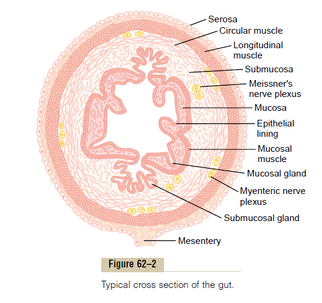

--- 
title: "Olimpiadinės biologijos gidas"
author: "Paulius Alaburda"
date: "`r Sys.Date()`"
site: bookdown::bookdown_site
documentclass: book
bibliography: [book.bib, packages.bib]
biblio-style: apalike
link-citations: yes
description: "Elektroninė knyga pasiruošti biologijos olimpiadai."
---

# Įžanga

Knyga yra nuolatos atnaujinama. Tai nėra galutinis produktas. Laukite naujienų!

```{r include=FALSE}
# automatically create a bib database for R packages
knitr::write_bib(c(
  .packages(), 'bookdown', 'knitr', 'rmarkdown'
), 'packages.bib')
```

## Turinys

* Augalai
  * Augalų struktūra ir augimas
  * Medžiagų pernaša augaluose
  * Augalų dauginimasis
  * Augalų hormonai
* Ląstelės biologija
  * Mikroskopija
  * Ląstelės struktūra
  * Ląstelės funkcijos
  * Funkcinis ir struktūrinis ląstelių santykis
  * Ląstelės membrana
  * Ląstelės metabolizmas
* Biochemija
  * Fermentų kenetika
  * Makromolekulės
* Gyvūnai
* Bakterijos
* Grybai
* Archėjos
* Pirmuonys

## TODO

1. Ištraukti skaidrių iliustracijas
2. Su line art sukurti schemas mokymuisi ir kartojimuisi
3. Pilvakojų praktikinis
4. Nuorodos
5. Iš skyriaus turi sugebėti atsirasti skaidrės arba paruoštukė
6. Sudėtingi klausimai diskusijai ir sprendimui
7. Nuorodos į kitus skyrius (kas nors neaišku - click to read up)
8. pdf capacity
9. collapse: subsection
10. {fold} for neat things
11. Plasticizers - difunduoja, nes nėra polimerizuoti ir yra hidrofobiški, sutrikdo hormonų signalo perdavimą (praktiniai darbai?)  
  
  
  
  
  

<!--chapter:end:index.Rmd-->

# Augalų įvairovė


## Tobulas sodas

**Mimosa pudica** yra lengviau auginti negu žmonės perspėja - tik svarbu sėklas sodinti į indą, kuris turėtų drenažą (sėklos ir šaknys jautrios neoringai arba permirkusiai žemei). Sudygusios jos nėra reiklios - joms tinka augti tiesioginėje saulės šviesoje, jeigu jos pakanka, augalas turėtų sužydėti sezono pabaigoje. Mimozos jautrios saulės šviesos pokyčiams - jeigu staiga mimoza gauna per daug saulės šviesos po ilgo tarpo mažai šviesos, lapai gali nudegti. Kadangi mimozų judėjimo mechanizmas reikalauja kalio, kas dvi savaites verta tręšti pomidorų trąšomis.

**Lychnis viscaria** sintetina daug brasinosteroidų, kurie turi teigiamą poveikį ne tik sau, bet ir aplinkiniams augalams. Augalas daugiametis, auginti šiltnamyje.

Augalų hormonų galima įsigyti internete. Auksinas skatina tįsimą ir dediferencijuoja augalų ląsteles (lieka kaliusas), giberelino rūgštis skatina žydėjimą. Triacontanolis ir brasinolidas (brasinosteroidas) skatina bendrą augalo augimą. Triacontanolis taip pat skatina rožių stiebų šakojimąsi ties žeme.


<!--chapter:end:augalu_ivairove.Rmd-->

# Bakterijos

## Bakterijų struktūra

## Santykis su žmogumi

## Antibiotikai

## Šaltiniai

Campbell Biology 27 skyrius "Bacteria and Archaea".

[Crash Course](https://www.youtube.com/watch?v=vAR47-g6tlA) video nėra labai geras.
[Kurzgesagt](https://www.youtube.com/watch?v=VzPD009qTN4)


<!--chapter:end:Bakterijos.Rmd-->

# Duobagyviai

Koralų sekcijos akvariumuose mane retai sužavi, bet o bet - ar žinojote, jog koralai priklauso tam pačiam tipui kaip ir medūzos, polipai ir anemonai? Kas iš viso yra anemonai? Dar geriau, tipas - duobagyviai - angliškai yra cnidaria, kilęs nuo lotyniško kniti - dilgelė. Bet yra dar viena potenciali kilmė iš žodžio "knisti" - to paties lietuviško/latviško žodžio. Be to, duobagyviai iš tikrųjų yra įdomūs - jie nusprendė, jog jie nori imituoti medžius ir turėti visą ekosistemą. Kiti gyvūnai - koralai yra gyvūnai - irgi nesibodi duobagyvių. Nedelsdami - nerkime gilyn!

Duobagyvius - stacionariuosius - galima prilyginti medžiams, nes kiekvienas koralas yra gyvas tik iš išorės. Po plonu, kelių ląstelių sluoksniu yra kalcifikuotas skeletas, kuris kiekvienais metais auga. Kai esi stacionari plėvelė, turi problemą - nebūtinai gali susirasti maisto ir nebūtinai tas maistas turės visas medžiagas, kurių reikės. Tai normalu - daug gyvūnų vykdo reikalingų molekulių sintezę. Bet duobagyviai savyje - savo vagose yra tuntas skirtingų bakterijų ir pirmuonių, be kurių duobagyvis neišgyventų. Tai mes turime visą ekosistemą mažame pakete.

Duobagyviai auga panašiai kaip medžiai - kiekvienais metais jie pagamina naują kalcio sluoksnį, dėl kurio koralas auga. Kiekvienais metais galima sekti ir carbon date'inti koralus.

<!--chapter:end:duobagyviai.Rmd-->

# Fermentai

Fermentai tokie svarbūs ląstelės biologijoje, jog nebūtų visiškai netikslu apibūdinti ląstelę kaip fermentų telkinį apsuptą plazminės membranos. Fermentai atlieka svarbią funkciją - jie sumažina reakcijų aktyvacijos energiją, jog reakcijos, kurios įprastai vyktų pernelyg lėtai išlaikyti gyvybę, galėtų vykti sparčiai.

## Fermentų struktūra

Didžioji dalis fermentų yra baltymai (maža dalis yra ribozimai). Fermentai yra globulės formos ir visi turi bendrą dalį - aktyvųjį centrą. Aktyvusis centras yra fermento vieta, kurioje fermentas sąveikauja su molekule, kurios reakciją fermentas katalizuos. Įprastai tokia molekulė yra vadinama *substratu*. Substratas sąveikauja aktyviajame centre su fermentoje amino rūgščių šoninėmis grupėmis. Įprastai tokios sąveikos tikslas - sumažinti molekulės stabilumą. Mažiau stabili molekulė yra labiau linkusi sąveikauti su kitomis molekulėmis. Kaip radikalai yra itin reaktyvūs, panašiai suardytas kovalentinis ryšys skatins substratą sudaryti naujus ryšius.

Svarbu pabrėžti, jog fermentai skatina reakcijos vyksmą į abi puses - fermentas su substratu sudaro tarpinį produktą, kuris turi panašią tikimybę arba virsti atgal į fermentą ir substratą, arba virsti į fermentą ir produktą. Bet jeigu reakcijos gali vykti į abi puses, koks tikslas jas skatinti fermentais? Kadangi mūsų ląstelė produktus naudoja kitoms reakcijoms, dėl mažėjančios suvartojamo produkto koncentracijos, reakciją taps linkusi vykti į "dešinę" - arba produkto pusę. Paprasčiausias pavyzdys yra H2CO3 suskaldymas į H2O ir CO2. Kadangi CO2 yra dujos, kurios nuolat šalinamos iš mūsų organizmo, mūsų organizme bus mažesnė koncentracija CO2 ir didesnė koncentracija H2CO3. Dėl to reakcija bus palankesnė į skilimo pusę. Lygiai taip pat reakcija vyktų priešingai, jeigu substrato būtų mažiau.

## Fermentų funkcijos

Kadangi fermentai gali skatinti reakcijų vyksmą, kokias reakcijas fermentai įprastai skatina mūsų organizme?

```{r}

Funkcija <- c("Sintezė")
Reakcija <- c("Naujų molekulių susidarymas")
Pavyzyds <- c("Gliukozės 6 fosfatas")
Reakcija <- c("Gliukozė → Gliukozės-6-fosfatas")


```


<!--chapter:end:fermentai.Rmd-->

# Imuninė sistema

## Skiepai

Be to, jog skiepai suteikia imunitetą skiepo gavėjui, jos turi lygiai taip pat svarbų poveikį stabdydamos infekcijos sukelėją tarp žmonių[^1]. Jeigu kas nors suserga gripu, susirgęs žmogus gali apkrėsti aplinkui tik tuos, kurie nėra pasiskiepiję nuo gripo. Atitinkamai, jeigu aplinkui tokį žmogų visi yra pasiskiepiję, gripas negalės plisti tarp žmonių. Tai vadinama populiaciniu imunitetu ("herd immunity") - nors pačių skiepai populiacinis imunitetas pakeisti negali, tačiau tai apsaugo žmones, kurie įprastai negalėtų pasiskiepyti. Seni žmonės, naujagimiai, pacientai su compromised imunine sistema (dėl ŽIV, pašalintos blužnies ar chemoterapijos) ir sunkiai sergantys pacientai, kurie visi įprastai negalėtų būti paskiepyti, tokiu būdu yra apsaugomi nuo užkrėčiamų ligų. Būtent dėl to ligoninės darbuotojams, kurių imuninė sistema yra patyrusi visko, rekomenduojama skiepytis kasmet nuo gripo.

https://upload.wikimedia.org/wikipedia/commons/f/f5/Herd_immunity.svg


[^1]: Tiesa, populiacinis imunitetas nepadeda apsisaugoti nuo ligų, kuriomis galima užsikrėsti iš aplinkos. Pavyzdžiui, stablige galima užsikrėsti *C. tetani* sporoms patekus į atvirą žaizdą.

<!--chapter:end:imunine_sistema.Rmd-->

# Kardiovaskulinė sistema

## Įžanga

Širdies ir kraujagyslių (arba kitaip, kardiovaskulinė) sistema yra tarpusavyje glaudžiai susijusios, tačiau širdies struktūra ir funkciją galima atskirti nuo kraujagyslių funkcijų. Ne veltui yra chirurgai, kurių vieni operuoja kraujagysles, o kiti - širdį! Šiame skyriuje aptarsime širdies struktūrą ir funkciją bei kraujagyslių struktūrą ir funkciją. 

Priešingai negu kitur, šiame skyriuje reikės daugiau fizikos žinių. Jeigu visai nežinote, kuo skiriasi turbulentinis ir laminarinė srovės, bei kaip slėgis kinta priklausomai nuo skerspjūvio ploto, rekomenduočiau šiuos skyrius pasikartoti. Nors šių žinių nereikės tiesiogiai, tai padeda suprasti, kaip organų sistema užtikrinti fizinio objekto - kraujo - judėjimą po organizmą. 

## Kraujagyslių iššūkis

Kraujagyslių sistema nėra būdinga visiems gyvūnams - duobagyviai sugeba užtikrinti tinkamą medžiagų pernašą be kraujagyslių. Problema iškyla tuomet, kai medžiagų įsisavinimas tampa lokalizuotas. Pavyzdžiui, kaip užtikrinti, jog gliukozė iš virškinamojo trakto pasiektų centrinę nervinę sistemą? Arba CNS gali būti arti vietos, kur vyksta virškinimas, arba evoliucijos eigoje gali atsirasti kraujagyslių sistema, kuri perneša maisto medžiagas iš virškinimo vietos iki audinių, kuriems reikia maisto medžiagų. Su kraujagyslėmis atsiranda papildomas iššūkis - kaip kraują stumdyti? Tam kraujagyslės gali susitraukti pačios, arba gali atsirasti specializuotas organas - širdis. 

Dar geriau, organizmui augant, kraujagyslės ir širdis turi prisitaikyti taip, jog kraujo cirkuliacija vyktų visame organizme. Geriausias pavyzdys yra žirafa - kaip ji užtikrina, jog kraujas pateks į galvą? Arba kaip smauglys užtikrins, jog jo uodegoje - kur širdies susitraukimas ko gero yra vos vos jaučiamas - kraujas judės? 

## Kraujagyslės

Kas yra kraujagyslės? Ieškodami bendrų kraujagyslių bruožų rastume, jog visos kraujagyslės turi endotelį. Tai - epitelinių ląstelių sluoksnis, kuris iškloja kraujagyslės vidinį spindį. Visos sveikos kraujagyslės - nuo kapiliarų iki arterijų - jį turi. Kapiliarai daugiau sluoksnių neturi, nes kapiliarų funkcija - užtikrinti medžiagų judėjimą iš kraujo į audinius. Tai reiškia, jog tarp kraujo ir audinių turi būti kuo plonesnis sluoksnis, jog galėtų vykti dujų ir medžiagų difuzija. Tuo pačiu, kapiliarai turi egzistuoti, jog kraujas liktų kardiovaskulinėje sistemoje.

Aišku, kai kurie gyvūnai (pvz, vabzdžiai) turi **atviras** kraujotakos sistemas, kuomet kraujas ir audinių skystis tarpusavyje maišosi ir sudaro hemocelį. Kodėl mes neturime **uždarą** kraujotakos sistemą? Viena, uždaroje sistemoje yra lengviau užtikrinti slėgį kraujagyslėse, todėl nereikia tokios didelės širdies kraujo transportui. Turėdami atvirą kraujotakos sistemą turėtume turėti žymiai didesnę širdį, jog palaikytų tinkamą hemocelio maišymąsi. Antra, nors kapiliarai sudaro barjerą tarp kraujo ir audinių, kapiliarai gali vingiuoti viduje audinio. Tokiu būdu mainai tarp audinių ir kraujo gali vykti žymiai produktyviau. Nors jie vis dar priklauso nuo difuzijos, kapiliarai užtikrina didesnį paviršiaus plotą mainams.

Jeigu žengtume žingsnį atgal link arterijų, susidurtume su keliomis problemomis. Kadangi arterijos šakojasi į kapiliarus, kapiliaruose slėgis yra labai mažas. Tačiau arterijose kraujo yra tiek, tačiau mažesniame skerspjūvio plote, todėl kraujo slėgis arterijoms yra žymiai didesnis. Vien endotelio neužtektų atlaikyti didesnį slėgį, todėl arterijos turi 2 papildomus sluoksnius. Viena, aplinkui endotelį yra lygiųjų raumenų sluoksnis, kuris įsitempęs gali padidinti kraujagyslės tvirtumą. Tai duoda papildomą pranašumą - esant poreikiui, kraujagyslės gali susitraukti arba atsipalaiduoti. Jeigu arterijos negalėtų prisitaikyti, organizmas nesugebėtų stumti kraujo per kapiliarus esant kraujo trūkumui. 

## 


<!--chapter:end:kardiovaskuline_sistema.Rmd-->

# Klausimai diskusijai

## Baltymai

1. Kokie yra baltymų struktūriniai lygiai?
2. Kokias funkcijas gali atlikti baltymai? Kokie yra kiekvienos funkcijos pavyzdžiai?

## Membraniniai kanalai

1. Kuo skiriasi amino rūgščių sekos, esančios kanalo viduje, išorėje transmembraniniame segmente ir išorėje?
2. Kokios molekulės gali judėti per membraninius kanalus?

Smulkios hidrofilinės molekulės: įprastai tai yra jonai, amino rūgštys ir gliukozė.

3. Kokiais būdais gali būti valdomi kanalai? Kokiose ląstelėse kiekvienu tipu valdomi kanalai gali būti randami?

Įtampa, ligandais, mechaniškai valdomi kanalai.

## Augalai

1.Kokie yra gaubtasėklių stiebo sluoksniai nuo išorės iki vidaus?

## Augalų hormonai

1. Kokios pagrindinės augalų hormonų kategorijos?

Auksinas, giberelinas, etilenas, abscisinė rūgštis, citokininai ir brasinosteroidai.

2. Koks auksino poveikis augalui?

Skatina ląstelių tįsimą, atverdamas protonų kanalus. Protonai aktyvina ekspansinus, kurie ardo sienelės celiuliozę. Ląstelės turgoras nebeturi pasipriešinimo, todėl ląstelė pradeda tįsti.

3. Koks giberelino poveikis augalui? Sėklai?

Augalui - skatina žydėjimą. Sėklai - skatina luobelę išskirti fermentus, kurie hidrolizuotų endospermo polimerus.

4. Koks etileno poveikis augalui? Vaisiui?

Skatina augalo trigubą atsaką: kamieno storėjimą, stiebo linkimą į kablio formą ir tįsimą suletėjimą.

5. Koks brasinosteroidų poveikis augalui?

* Kartu su auksinu skatina ląstelių tįsimą
* Skatina ląstelių senėjimą
* Skatina atsparumą sausroms, šalnoms ir ligoms
* Skatina žiedadulkių dulkiadaigio tįsimą

6. Koks abscisinės rūgšties (ABA) poveikis augalui?

Skatina žiotelių užsivėrimą. ABA skatina žiotelių ląsteles į išorę išskirti kalį, o kartu ir vandenį. Tai mažėja varstomųjų ląstelių turgoras ir žiotelė užsidaro.

7. Kokios citokininų funkcijos?

* Skatina ląstelių dalijimąsi
* Skatina žaizdų gijimą
* Jeigu koncentracija lygi auksino, skatina dalytis ląsteles
* Jeigu koncentracija mažesnė negu auksino, skatina formuotis šaknis
* Jeigu koncentracija didesnė negu auksino, skatina formuotis stiebus

## Bakterijos

1. Kokios yra bakterijų pagrindinės dalys?
2. Kas yra gram dažymas? Kuo skiriasi gram neigiamos ir gram teigiamos bakterijos?
3. Kokie yra antibiotikų veikimo mechanizmai? Kodėl antibiotikai įprastai nėra pavojingi žmogui?
4. Kokiais trimis mechanizmais bakterijos horizontaliai perduoda genetinę informaciją?
5. Kuo šie būdai yra susiję su atsparumu antibiotikams?


<!--chapter:end:klausimai.Rmd-->

# Kraujotaka

## Kas yra širdies stimuliatorius?

<!--chapter:end:kraujotaka.Rmd-->

# Ląstelės struktūra

# Šaltiniai
https://elifesciences.org/articles/32493

<!--chapter:end:lasteles_struktura.Rmd-->

# Nervinė sistema

## Neuroplastiškumas

Per paskutinius 10 metų idėja apie galimybę [lavinti savo smegenis](https://trends.google.com/trends/explore?date=2004-05-20%202019-06-20&geo=US&q=rewire%20brain) spėjo ganėtinai sparčiai išpopuliarėti. Lietuvoje galima rasti išverstų knygų apie [smegenų plastiškumą](https://kitosknygos.lt/knygos/Save-keiciancios-smegenys), tėvai daugiau šneka apie kritinius vaikų vystymosi periodus, o Urtės Neniškytės atliekami tyrimai susilaukia [visai](https://www.youtube.com/watch?v=WDF40W0QVn0) [nemažai](https://www.youtube.com/watch?v=ezKhpOB7ZyE) [susidomėjimo](https://www.youtube.com/watch?v=9kXFrAyKs4U). Žmonės nori daugiau žinoti apie tai, kas sėdi kaukolėse.

Neuroplastiškumas yra idėja, jog mūsų centinė nervinė sistema gali augti ir keistis priklausomai nuo išorinių stimulų. Apie "save keičiančias smegenis" jau buvo pradėta šnekėti XVIII a. aštuntajame dešimtmetyje, kuomet Charles Bonnet ir Michele Vincenzo[n1], dresuodami šunis ir paukščius, rado didesnes smegenėles palyginus su nedresuotais gyvūnais. Idėja nebuvo nauja - žmonės jau žinojo, jog treniruojamas organas gali prisitaikyti (pavyzdžiui, raumenys). Vėlesni tyrėjai – vienas jų Jean-Baptiste Lemarck, Charles Darvino oponentas – teigė, jog specializuoti smegenų regionai vystosi tik tinkamai naudojantis savo gebėjimais. Pavyzdžiui, regionas atsakingas už regą vystosi tik naudojant regą.

Tik vėliau, ketvirtajame dešimtmetyje, Theodore Schwann ir Matthias Schleiden išvystė ląstelių teoriją. Nervinis audinys tuo metu buvo per smulkus, jog galėtume atsakyti, ar jis sudarytas iš ląstelių, todėl atsirado dvi stovyklos: neuronistai, manantys, jog nervinis audinys sudarytas iš individualių neuronų, ir retikulistai, manantis, jog tai yra vienas vientisas audinys. Tik XIX a. devintajame dešimtmetyje Santiago Ramon y Cajal naudodamas naujus dažymo būdus atrado, jog smegenys sudarytos iš atskirų neuronų. Šis atradimas davė pagrindą neuromokslams kaip atskirai šakai.


Cajal tyrimai davė pagrindą ne tik neuronams, bet ir santykiams tarp jų. Sudėtingos neuronų struktūros ir glaudūs ryšiai tarp ataugų suformavo idėją, jog neuronai tarpusavyje siunčia signalus per sinapses[n2] - specializuotas vietas neuronuose, kuriose vieno neurono elektrinis signalas yra perduodamas kitam neuronui. Cajal manymu, mokymasis ir darbas skatina naujų dendritų ir aksonų augimą. Deja, ši idėją buvo greitai atmesta. Kadangi smegenų masė ir tūris išlieka panašūs žmogui subrendus, sunku tikėti, jog smegenys gali keistis. Iš tikrųjų XX a. pradžioje ši nuomonė išplito ir buvo ilgai manoma, jog smegenys nesikeičia įgyjant naujas patirtis.

Tokia paradigma išliko gaji iki septinto dešimtmečio, kuomet neuromokslininkas Paul Bach-y-Rita atrado, jog akli žmonės sugeba "matyti" lytėjimo pagalba. Tuomet, aštuntajame dešimtmetyje Tim Bliss ir Terje Lomo atrado ilgalaikę sinapsių potenciaciją (long-term potentiation, LTP). LTP nuo tada yra vienas labiausiai išstudijuotų fenomenų nervinėje sistemoje, kuris duoda pagrindą sinapsių ilgalaikiškumui. Deja, LTP nepadeda gerai atsakyti, kaip mes mokomės ir kuriame atsiminimus. 

## Centrinės nervų sistemos dalys

Centrinė nervų sistema gali būti padalinama į dvi dalis: galvos ir nugaros smegenis. Nugaros smegenys savaime funkcijos neturi, nes tai yra daugiausia tarpinė nervų aksonų ir dendritų stotelė iš ir į periferinę nervų sistemą.


[n1]: Neuroplasticity, MIT Press (2016)
[n2]: Terminas sinapsė atsiras tik vėliau, 1897 m.

<!--chapter:end:nervine_sistema.Rmd-->

# Augalų įžanga

## Ląstelė

Skiriasi nuo eukariotinės gyvūno ląstelės šiais bruožais:

1. Chloroplastai
2. Centrinė vakuolė
3. Plazmodezmos[^1] jungia ląsteles
4. Ląstelės sienelė
5. NĖRA centriolių

## Chloroplasto struktūra ir funkcija

1. Dviguba membrana (pūslelė pūslelėje), viduje yra stroma, kurioje yra išsidėstę tilakoidai. Tilakoiduose yra fotosintezės aparatas, tilakoidai yra išsidėstę į granas.
2. Chloroplasto funkcija versti saulės energiją į angliavandenius. Tai vyksta dviem etapais: šviesos ir tamsos reakcijomis. Šviesos reakcijos 

## Plazmodezmos

```{r}

knitr::include_graphics("static/augalai/augalo_dalys.png")

```


## Ląstelės sienelė

## Plastidės

Centrinė vakuolė


Terminai

[^1]: Plazmodezmos - tai citoplazminis tiltelis tarp dviejų augalo ląstelių. Per jį gali judėti citoplazmos turinys, organelės bei virusai.

<!--chapter:end:plant_intro.Rmd-->

# TODO

1. Male and dog fertility - related to plastics?
2. Ką skirtingi numeriai reiškia ant buteliukų?

# Plastikas

Myliu plastiką ir myliu jo pritaikymą - vandens buteliai, kateteriai, vamzdžiai ir vamzdeliai, konstrukcijos, čekiai. Plastikas yra _visur_ ir natūraliai iškyla klausimas - ar gali būti problemų dėl to? FDA 2012 m. uždraudė tam tikrus plastikus kūdikių buteliukų sudėtyje ir Europos chemikalų agentūra nurodė, jog bisfenolis A (BPA, apie jį vėliau)

Anksčiau šnekėjome apie hidrofobines molekules - riebalų rūgštis, vaškus, steroidinius hormonus, visą puokštę molekulių, kurioms reikia išskirtinių sąlygų funkcionuotų organizme. Daugiausia dėl to, jog hidrofobinės molekulės yra linkusios lengvai difunduoti. Dėl to taip sunku numalšinti aštrumą maiste - kapsacinas, kuris sukelia aštrumą, yra hidrofobiškas ir sunkiau nusiplauna su vandeniu.

Bet iš hidrofobinės kilmės mus supa ne tik kapsaicinas - turime aliejus, riebalus, alyvas ir...plastikus. Techniškai, plastikai yra hidrofobiški, tačiau taip pat jie yra ilgi, tarpusavyje susipynę polimerai. Jie neturi reikalo maišytis su riebalais - lygiai taip pat kaip krakmolas vangiai tirpsta vandenyje. Esame saugūs tuo atžvilgiu.

Aišku, visur yra niuansų ir prieš eidamas į juos iškart turiu perspėti - daugiausia tai pagrįsta principais ir sveikatos organizacijų rekomendacijomis. Nepanašu, jog tyrimai yra atlikti ištirti ekstremalius atvejus, panašiausia, jog plastikų naudojimas rizikos sveikatai nesukelia. Nebent, nežinau, gersite lydytą plastiką?

So, visų pirma, plastikai yra polimerai - jie turi sureaguoti tarpusavyje iš smulkesnių komponentų - monomerų - jog taptų modeliais, vamzdeliais ir visu kuo kitu. Kadangi tai chėminė reakcija, visada reikia atsiminti, jog kažkokia procentinė dalis bus likusi nesureagavusi ir ištirpusi plastike. Kai šnekame apie BPA patekimą į vandenį, mes turime omenyje ne patį tirpstantį plastiką - kas nenutinka, nes plastikas degraduoja šimtus metų - o nesureagavusius monomerus. Jie gali reaguoti su estrogeno receptoriais, bet jų afinitetas yra 1000 kartų mažesnis. Neįsivaizduoju, kiek reikia turėti kontakto su plastiku, jog pavyktų gauti didesnes koncentracijas negu tos, kurios yra kiekvieno iš mūsų organizme (įskaitant vyrų). 

Įveskime dar vieną vingį - jeigu bandytume sukurti plastiką, mes gautume kažką kieto ir trapaus. Ką daryti, jeigu nori plastiką suminkštinti? Įdėk plasticizuojančios (?) medžiagos. Tai yra hidrofobiška maža molekulė, kuri padidina plastiko...skystumą/tirštumą. Pridėk šiek tiek, gausi PVC vamzdžius, pridėk daugiau, gausi katetetį. Viskas paprasta ir smagu. Problema - tai smulki molekulė. Problema - gali išdifunduoti esant aukštai temperatūrai.

Tai kur visa problema? Tai negali mums kenkti - bet smulkus plastikas gali kenkti aplinkai. Augalai turbūt gali išgyventi savaime, bet gyvūnai - ypač tie, kurie minta filtruodami vandenį - susiduria su problemomis. 

Male and dog fertility?

# Plastikai

Plastikas - mylime, bet ir nekenčiame, galvodami, jog jis kenksmingas. Taip, jis yra kenksmingas, bet ne mums, o aplinkai. 


<!--chapter:end:plastikai.Rmd-->

# Skiepai

Visi esate girdėję apie skiepus ir ko gero galite paaiškinti, kodėl jie skirti. Bet iš paskutinių kelių metų anti-vakcinuotojų bangos aišku - nebūtinai yra aišku, kas yra vakcinos. Šiame skyriuje sužinosite apie vakcinas, jų pagrindinę sudėtį ir sukeltą atsaką organizme.

## Kas tai?

Vakcinos, technine prasme, yra preparatas, kuris suteikia aktyvų įgytą imunitetą jos gavėjui. Vakcinos sudėtyje yra medžiaga, kuri primena ligą sukeliantį mikroorganizmą. Medžiaga, šiuo atveju, platus terminas tyčia - tai gali būti arba silpna, arba nebeveikli užkrato versija, arba tik dalis paties užkrato. Pavyzdžiui, rotaviruso vakcinoje yra atenuotas (susilpnintas) rotavirusas, kuris vis dar gali daugintis, bet negali sukelti ligos. Vakcinose taip pat gali būti ir užmuštos bakterijos arba tik jų specifiniai antigenai (membranos lipidai arba baltymai), kurie sukelia imuninį atsaką.

Vakcinos veikia skatindamos imuninę sistemą išvystyti imunitetą. Jeigu jau skaitėte skyrių apie imuninę sistemą, jau galite įsivaizduoti, jog atsakui į vakciną reaguoja T atminties ląstelės, kuriuos skatina B limfocitus subręsti į plazmines ląsteles ir gaminti antikūnus. Kitą kartą, kai organizmas susidurs su tikruoju užkratu, kraujyje jau cirkuliuos antikūnai, kurie greitai neutralizuos infekciją.

Papildoma vakcinų sudėtis stimuliuoti imuninį atsaką.

Tiomersalio naudojimas

## Vakcinų tipai

## Vakcinos veikimo trukmė

## Vakcinų šalutiniai poveikiai

## Vakcinų ateitis

<!--chapter:end:vakcinos.Rmd-->

# Virškinimo sistema

Šiame skyriuje dėmesys bus skiriamas tik žmogaus virškinimo sistemai. Kitaip skyrius būtų pernelyg ilgas - virškinimo sistemos gyvūnų karalystėje yra labai įdomios, pradedant [vabzdžiais ir **Wolbachia** bakterijomis](https://www.ncbi.nlm.nih.gov/pmc/articles/PMC3873267/) ir [baigiant žarnyno sąveika su bakteriofagais](https://www.ncbi.nlm.nih.gov/pmc/articles/PMC5553654/). Tyrimai su mikrobiota ir virškinimo traktu yra bene patys karščiausi tyrimų objektai šiuo metu ir ko gero išliks artimiausią dešimtmetį.

## Virškinimo trakto struktūra

### Bendri principai

Išskyrus burną, visa virškinimo sistema remiasi bendra taisykle: virškinamojo trakto spindį iškloja gleivinė, po kuria yra kapiliarais ir jungiamuoju audiniu išraizgytas pogleivis. Pogleivį supa du lygiųjų raumenų sluoksniai - žiedinis ir išilginis. Raumeninį sluoksnį dengia seroza, kuri atlieka dengiamąją funkciją. Jeigu paimtume bet kurį segmentą - ar tai būtų skrandis, plonoji ar storoji žarna - visur rastume tokią pačią struktūrą.


```{r my-fig, fig.cap="fig caption"}



```


Kiekvienas sluoksnis turi skirtingą funkciją:

```{r, echo = F}

library(tidyverse)
library(knitr)

Sluoksnis <- c("Gleivinė","Pogleivis","Raumeninis sluoksnis","Seroza")
Funkcija <- c("Medžiagų absorbcija ir turinio jutimas","Medžiagų išnešiojimas į kraujotaką","Turinio spindyje maišymas ir stumimas pirmyn","Žarnyno dengimas nuo likusių organų")

tibble(Sluoksnis,Funkcija) %>% kable


```


## Kepenys

Kepenys yra parenchiminis organas, kuris turi kapsulę ir atlieka labai daug funkcijų. Evoliucijos eigoje kepenys atsirado kaip organas, filtruojantis medžiagas, absorbuotas virškinimo metu. Iš tikrųjų be kepenų (pavyzdžiui, kepenų cirozės, kuomet kepenys yra peraugusios jungiamuoju audiniu) žmogus apsinuodija azoto turinčiomis medžiagomis, ką jau kalbėti apie amoniaką, kuris susidaro amino rūgščių apykaitos metu. Kepenys įprastai detoksifikuoja medžiagas sujungdamos jas su kitomis molekulėmis, pavyzdžiui, amoniaką sujungus su anglies dioksidu organizmas pagamina šlapalą, kurį pašalina per inkstus. Didelė įvairovė vaistų yra biotransformuojami prie jų prijungus papildomas šonines (pavyzdžiui, hidroksil, karboksi arba glutationo) šonines grupes.

Be kenksmingų medžiagų biotransformacijos, kepenys taip pat gamina kraujo baltymus, atsakingus už onkotinio slėgio palaikymą ir kraujo krešėjimą, kaupia vitaminą A ir E, išskiria bilirubiną kaip tulžies rūgštį į virškinimo traktą, ir taip pat turi arsenalą makrofagų (Kupferio ląstelių), kurios monitoruoja kraujotaką.

## Virškinimo fermentų sąrašas

```{r, echo = F}

macromol <- c(rep("Angliavandeniai",5),
              rep("Baltymai",7),
              rep("Lipidai",2)) 
fermentai <- c("Seilių amilazė",
               "Kasos amilazė",
               "Maltazė",
               "Sacharazė",
               "Laktazė",
               "Pepsinas",
               "Tripsinas",
               "Chimotripsinas",
               "Karboksipeptidazė",
               "Aminopeptidazė",
               "Dipeptidazė",
               "Enterokinazė",
               "Tulžis (ne fermentas!)",
               "Lipazė")
vieta <- c("Seilių liaukos",
           "Kasa",
           rep("Žarnyno liaukos",3),
           "Skrandžio liaukos",
           rep("Kasa",3),
           rep("Žarnyno liaukos",3),
           "Kepenys",
           "Kasa")
taik <- c("Burna",
          rep("Plonoji žarna",4),
          "Skrandis",
          rep("Plonoji žarna",8))
funkc <- c("Hidrolizuoja krakmolą į maltozę",
           "Hidrolizuoja krakmolą į maltozę",
           "Hidrolizuoja maltozę į 2 Glc molekules",
           "Sacharozė į 1 Glc ir 1 Fructozę",
           "Laktozė į 1 Glc ir 1 galaktozę",
           "Specifiniai peptidiniai ryšiai",
           "Specifiniai peptidiniai ryšiai ir konvertuoja chimotripsinogeną į chimotripsiną",
           "Specifiniai peptidiniai ryšiai",
           "Hidrolizuoja ryšius ties karboksiliniu terminalu",
           "Hidrolizuoja ryšius ties amino terminalu",
           "Hidrolizuoja amino rūgščių poras",
           "Verčia tripsinogeną į tripsiną",
           "Riebalų emulsija",
           "Hidrolizuoja riebalus")
df <- tibble(Medžiaga = macromol,
                 Fermentas = fermentai,
                 Sekretuoja = vieta,
                 Veikia = taik,
                 Funckija = funkc)
kable(df)

```

Test


<!--chapter:end:virskinimo_traktas.Rmd-->

