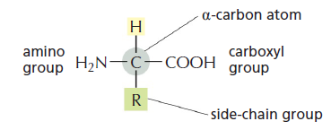
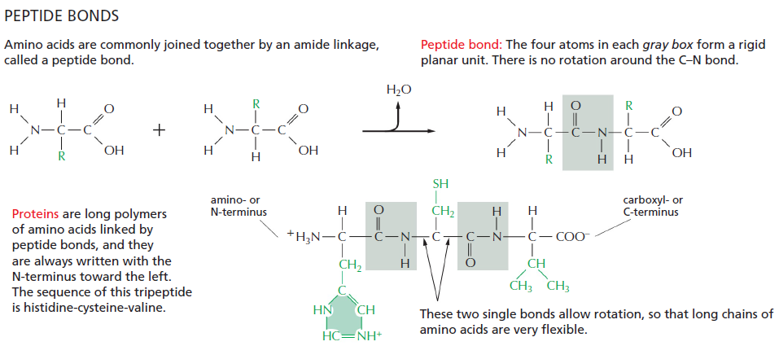
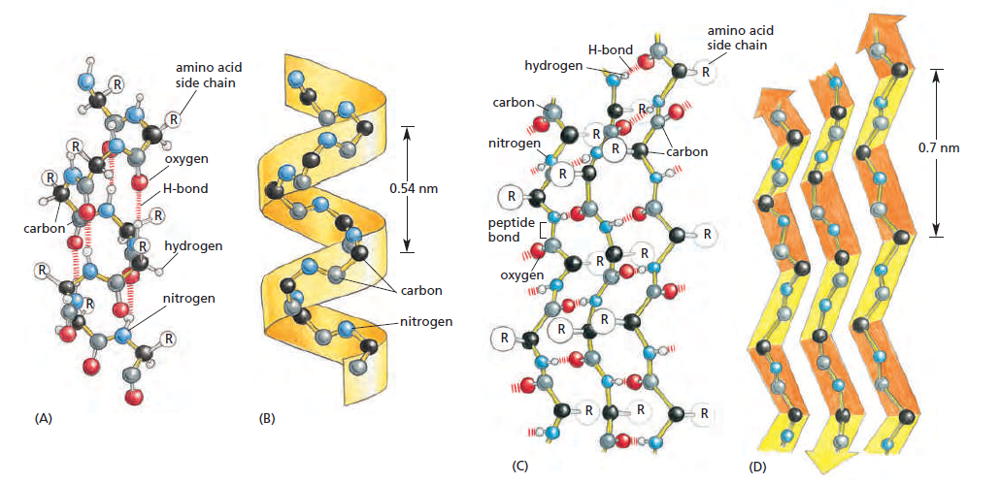

# Baltymų struktūra

Iš visų makromolekulių baltymai yra verti atskyro skyriaus, nes baltymai turi daugiausia skirtingų monomerų ir gali sudaryti daugiausia skirtingų unikalių molekulių. Ląstelės gerą dalį sudaro baltymai, bet baltymai yra ne tik ląstelės statybinė medžiaga, bet baltymai atlieka daugumą ląstelės funkcijų. Kalbant apie baltymus galima užkabinti daug skirtingų temų - baltyminius kanalus, fermentus, antikūnus - bet šiame skyriuje daugiausia dėmesio bus skirta suprasti baltymų struktūrą ir baltymų sąveikas su kitomis molekulėmis.

Biologijos egzaminui svarbu suprasti visus struktūros lygmenius nuo pirminio iki ketvirtinio, bet drįsčiau sakyti, jog svarbiausia suprasti, iš ko sudaryta polipeptidinė grandinė ir kaip ji gali sąveikauti su savimi. Su geru supratimu, kaip tai vyksta, visus struktūrinius lygius suprasti bus lengviau.

```{r, echo = FALSE}

knitr::include_url("https://www.youtube.com/embed/hok2hyED9go")

```

## Pirminė struktūra - peptidiniai ryšiai

Amino rūgštis yra sudaryta iš *centrinės anglies, karboksigrupės, amino grupės ir šoninės grupės*. Visos amino rūgštys turi bendrą struktūrą, vienintelis skirtumas yra jų šoninė grupė.

```{r}



```

Šoninė grupė *nedalyvauja* pirminėje baltymo struktūroje, baltymo stuburą suformuoja karboksilinė ir amino grupės. Šoninė grupė praktiškai lemia viską, išskyrus pirminę struktūrą, todėl jos apibūdintos detaliai žemiau, bet dabar svarbu parodyti peptidinio ryšio susidarymą:

```{r}



```

Iš principo tai yra kondensacijos reakcija ir daugiau apie ją galima rasti skyriuje apie baltymų sintezę. Nors iš *amino rūgščių* susidaro *polipeptidas*, karboksilinė ir amino grupės dar turės rolę suformuodamos antrinę baltymo struktūrą.

## Baltymo formą lemia amino rūgščių seka

Polipeptidas yra lanksti tiesinė molekulė. Polipeptido skeleto N-H ir C=O grupės turi teigiamą bei neigiamą krūvį. Iš 20 galimų amino rūgščių, kai kurios iš jų yra polinės ir turi neigiamą arba teigiamą krūvį, kai kurios yra nepolinės ir iš principo yra hidrofobinės. Polines amino rūgštis galima skaidyti toliau į dvi grupes - šoninės grupės, kurios gali jonizuotis, ir kurios negali. Visos šios grupės gali tarpusavyje sąveikauti.

Jėgos tarp šių grupių lemia polipeptido formą. Tarp N-H ir C=O (šoninių grupių ir polipeptido skeleto!) gali susidaryti *vandeniliniai ryšiai*. Tarp jonizuotų teigiamų ir neigiamų grupių gali susidaryti *elektrostatinės sąveikos*. *Hidrofobinė sąveika* ir *van der Waals jėgos* tarp hidrofobinių šoninių grupių lemia, jog hidrofobinės amino rūgštys grupuosis kartu. Šios keturios pagrindinės jėgos nulems, į kokią formą susilankstys baltymas.

Baltymai, neveikiami aplinkos, susilanksto į tokią pačią formą. Aišku, ląstelėje yra šimtai kitų baltymų, su kuriais šviežiai pagamintas polipeptidas gali sąveikauti, todėl ląstelėje yra *molekuliniai šaperonai*, kurie izoliuoja baltymą nuo aplinkos ir leidžia baltymai lengviau pasiekti savo natyvią formą. Baltymai turi visą informaciją savyje, pagal kurią baltymas įgyja savo formą, šaperonai tik padeda ją įgyti greičiau ir dažniau.

Nors baltymai gali būti įvairių formų dėl begalės amino rūgščių kombinacijų, baltymų trimatė struktūra turi bendrų bruožų - tai antrinė struktūra. 

## Antrinė struktūra

Amino grupės N-H grupė turi teigiamą krūvį, nes elektronai dalyvauja polipeptidiniame ryšyje ir yra patraukti O-C grupės pusėn. C-O grupė tuo tarpu yra neigiamai įkrauta. Jeigu baltymas yra pakankamai ilgas, šios grupės pradės sudaryti vandenilinius ryšius ir sudaryti dvi galimas struktūras: *alfa spirales* ir *beta klostes*. Tai yra labai stabilios struktūros ir jos *susiformuoja savaime*.

```{r}



```

Alfa spiralės yra labai naudingos, nes jos nukreipia polines molekulės dalis sudaryti vandenilinius ryšius tarpusavyje, o šonines grupes nukreipia į įšorę. Alfa spiralės yra dažnas fragmentas transmembraniniuose baltymuose, pavyzdžiui, receptoriuose ar transportiniuose baltymuose. Tokių alfa spiralių šoninės grupės bus nepolinės, jog galėtų sąveikauti su fosfolipidų uodegomis, tuo tarpu *hidrofilinis polipeptido skeletas* sudaro vandenilinius ryšius su savimi ir yra pridengtas šoninių grupių nuo membranos.

Taip pat alfa spiralės padeda nukreipti šonines grupes į vieną pusę. Pirminėje struktūroje polipeptidinė grandinė gali laisvai sukiotis, bet kai šoninės grupės yra nukreiptos į vieną pusę ir jos nejuda, keli polipeptidai gali tarpusavyje susisukti ir sudaryti *susuktą spiralę*. Tai yra labai palanki ir stabili baltyminė struktūra, būdinga miozinui, kolagenui ir alfa-keratinui[^1].

[^1]: Beje, alfa spiralės buvo atrastos alfa keratino molekulėje.

Beta klostės per daug savaime nėra ypatingos, bet svarbu pabrėžti, jog antrinės struktūros savaime nenurodo baltymo funkcijos. Tai yra tik tarpiniai blokai, ir abi struktūros gali būti tame pačiame baltyme skirtingais kiekiais. Tik iš tretinės struktūros galime spręsti apie baltymo funkciją.

Polipeptidinis skeletas šioje vietoje jau atliko savo funkciją apsijungdamas į stuburą ir sudarydamas alfa spirales ir beta klostes. Šoninės grupės per savo sąveikas tretiniame lygyje lemia baltymo formą, sąveikas su kitomis molekulėmis ir funkciją.

## Tretinė struktūra

Be amino ir karboksi grupių, kurios turi krūvį, šoninės grupės taip pat daro įtaką ir iš principo lemia galutinę baltymo formą. Kadangi yra 20 amino rūgščių, labai nesunku sukurti polipeptidą, kuris įgytų specifinę formą. 

Amino rūgštys yra keturių rūšių: rūgštinės, bazinės, neįkrautos polinės ir nepolinės. Baltymo amino rūgščių seka lemia jo funkcijas, pavyzdžiui, bazinės šoninės grupės leidžia sąveikauti su DNR (DNR skeletas turi neigiamą krūvį, todėl reikalingas teigiamas krūvis sąveikai), o nepolinės amino rūgštys (triptofanas, leucinas) gali sąveikauti su hidrofobinėmis molekulėmis (pavyzdžiui, nepolinės amino rūgštys dažnos transmembraniniuose baltymų domenuose). O kas yra polinės neįkrautos amino rūgštys? Rūgštinės ir bazinės amino rūgštys gali jonizuotis (prarasti arba įgyti vandenilio joną), tuo tarpu yra amino rūgščių, kurios negali praprasti vandenilio jono, bet turi krūvį dėl azoto, deguonies atomų arba benzeno žiedo.

Polipeptidas dėl savo amino rūgščių pradeda lankstytis dėl tam tikrų sąveikų: joninės amino rūgštys sąveikauja per elektrostatines sąveikas - teigiamos šoninės grupės traukia neigiamas. Hidrofobinės arba nepolinės amino rūgštys pradeda sąveikauti per van der Waals jėgas. Galiausiai, kai kurios šoninės grupės gali tarpusavyje sudaryti vandenilinius ryšius.

Dėl šių ryšių polipeptidas gali spontaniškai suformuoti tretinę struktūrą, tačiau dažnai spontaninė forma yra laikoma "išsilydžiusios globulės" forma. Dažnai baltymui galutinę formą įgyti reikia išorės pagalbos. Viena iš jų - disufildinių tiltelių formavimas. Dvi cisteino šoninės grupės gali sudaryti kovalentinį ryšį ir savaime, bet tam tikromis sąlygomis reikia fermento.

## Ketvirtinė struktūra

Baltymas sulankstytas, ką dar galima padaryti? Ketvirtinę struktūrą baltymas įgauna, kai keli baltymai yra sujungiami kovalentiniais ryšiais. Pavyzdžiui, hemoglobino monomeras yra globulinis baltymas, bet hemoglobinas iš tikrųjų sudarytas iš keturių subvienetų.

Dažnesnis pavyzdys yra skaiduliniai baltymai - pavyzdžiui, aktiną, tubuliną ir keratiną mes įsivaizduojame kaip filamentus. Bet ilga, filamentinė struktūra yra ketvirtinė - skaidulas sudaro globuliniai baltymai subvienetai.

## Baltymų domenai

Visos kalbos apie skirtingus struktūrinius lygius yra smagu, bet be visų šių struktūrų galima išskirti *baltymų domenus*. Baltymo domenas yra polipeptido sritis, kuri gali susilankstyti iki tretinės struktūros nepriklausomai nuo kitų polipeptido sričių. Įprastai domenas yra nuo 40 iki 350 amino rūgščių ilgio ir tai yra vienetai, kurie įprastai atlieka specifinę funkciją baltyme. Jeigu amino rūgštys yra baltymo kaladėlės, tuomet baltymo domenai yra stambesnės konstruktoriaus dalys, kurios sudaro galutinį konstruktorių.

Baltymai įprastai turi vieną funkciją, bet viduje domenai gali atlikti daug skirtingų funkcijų. Pavyzdžiui, Src baltymų kinazė turi vieną domeną, kuris turi fermentinį (katalitinį) aktyvumą, bet yra papildomi du domenai, kurie gali reguliuoti katalitinio domeno aktyvumą. Kitaip tariant, jeigu baltymas turi kažką papildomai daryti (įsitvirtinti membranoje, būti reguliuojamas), jis turi papildomų domenų.

## Polipeptidų išimtys...

Iš pirmo žvilgsnio atrodo, jog baltymai yra kaip močiutės sodas - kad ir kas jam nutiktų, jis visada įgys tą pačią tvarkingą formą. Iš tikrųjų taip nebūtinai yra - kai kurios baltymo sekos gali būti specialiai netvarkingos. Kelios pagrindinės priežastys:

1. Sąveika su kitomis molekulėmis - pavyzdžiui, histonai turi uodegas, kurios tėra laisvai plūduriuojančios polipeptidinės sekos. Šios sekos turi teigiamų amino rūgščių ir gali sąveika su neigiamu DNR sksletu.
2. Signalo perdavimas - jeigu reikia pažymėti baltymą, jog kitas baltymas su juo sąveikautų, dažnai yra sekos skirtos fosforilinimui.
3. Domenų sugretinimas - kai kuriais atvejais vienas fermentas gali turėti kelis domenus, kurie vykdo reakcijas, todėl laisvos sekos gali domenus sugretinti. Tokiu būdu įvykus vienai reakcijai substratas yra arti kito aktyviojo centro. Tai padidina fermento reakcijos greitį.
4. Barjerinė funkcija - ląstelė gali panaudoti polipeptidines sekas kaip barjerą. Pavyzdžiui, nukleoporinai branduolio membranoje sudaro barjerą, kuris riboja difuziją ir izoliuoja branduolio vidinę terpę nuo citoplazmos.
5. Struktūrinė - elastinas poodyje atsispiria tempimo jėgoms, nes jis turi nesusilanksčiusių sekų. Tai leidžia baltymui keisti savo ilgį, o kai nebėra tempimo - susitraukti atgal, o kartu sutraukti atgal ir odą.

## Disulfidiniai tilteliai

Disulfidiniai tilteliai yra svarbūs ekstraląsteliniams baltymams - aplinka ląstelėje yra dėkinga ir kovalentinių ryšių baltymo stabilizavimui nereikia. Tačiau aplinka už ląstelės yra nestabili. Baltymuose disulfidiniai tilteliai sutvirtina baltymo struktūrą. Jeigu įsivaizduotume baltymą kaip popieriaus lapą, kuris sujungtas klijais, tai disulfidiniai tilteliai yra lyg susegimas stapleriu. Klijai drėgni ir su pakankamai jėgos juos galima išdalinti. Bet segtuką reikėtų specifiškai išimti nesuplėšant lapo. 

## ⚕️ Prioninės ligos

Prionai - tai baltymai, kurie įgijo neteisingą konformaciją, t.y. susilankstė neteisingai. Sąveika su normalia baltymo kopija sukelia tokį patį pokytį tame pačiame pokytį. Tokiu būdu neteisingai susilankstęs baltymas dauginasi ir formuoja baltymų agregatus. Šie agregatai gali sukelti ligas, pavyzdžiui, Creutzfeldt–Jakob ligą, Kuru arba kempinligę galvijuose. Prionai yra stabilūs baltymai, todėl kitas žmogus ar galvijas, suvalgęs baltymą prioną, gali užsikrėsti prionine liga.

## ⚕️ Cistinė fibrozė

## Baltymų pavyzdžiai

Visas šitas skyrius ilgas, tačiau dabar galime paaiškinti bet kokį baltymą iš struktūrinių lygių pusės. Jeigu mus domins konkretus baltymus, galėsime mąstyti apie jo sandarą iš lygių pusės. Kalbėdami apie ląstelės struktūrą, suprasti visus lygmenys nereikia žinoti, nes ląstelėje apie baltymus daugiau galvojame kaip apie funkciją atliekančius vienetus ir jų struktūra yra mažiau svarbi.

Labai geras pavyzdys yra baltymai kanalai. Neuronai turi daug joninių kanalų, pavyzdžiui, įtampa valdomų natrio kanalų. Kanalai baltymai įprastai turi kelis domenus, bet galime susikoncentruoti tik į vieną domeną atsakingą už jonų pernešimą per plazminę membraną, nes domenai funkcijos atžvilgiu yra nepriklausomi. Toks kanalas sudarys daug $\alpha$ spiralių, jog hidrofobinės amino rūgštys būtų nukreiptos į išorę link plazminės membranos, o hidrofilinės amino rūgštys į kanalo vidų, jog sąveikautų su jonais. Iš šių antrinių baltymų struktūrų formuosis tretinė struktūra - pora. Hidrofilinės amino rūgštys viduje kanalo tikėtina, jog jos turės neigiamą krūvį, nes priešingu atveju natris būtų atstumtas teigiamo krūvio. Struktūriškai pora bus specifiška tik natriui, nes tretinė struktūra turi specifinę erdvinę formą, kuri neleidžia kaliui patekti į poros spindį, o kitiems teigiamiems jonams trukdo netinkama forma sąveikauti su glutamo rūgšties liekanomis poros spindyje. Per pirminę struktūrą (amino rūgščių seką), antrinę struktūrą (alfaspirales) ir tretinę struktūrą (porą) sugebėjome paaiškinti baltymo funkciją.


## TODO

Use Molecular Biology of the Cell as reference
Use old protein slides and circa 2012 LitBo material 
Use Alberts ToC and subchapter titles as prompts for writing

https://en.wikipedia.org/wiki/Sodium_channel
Cystic fibrosis protein mutations

