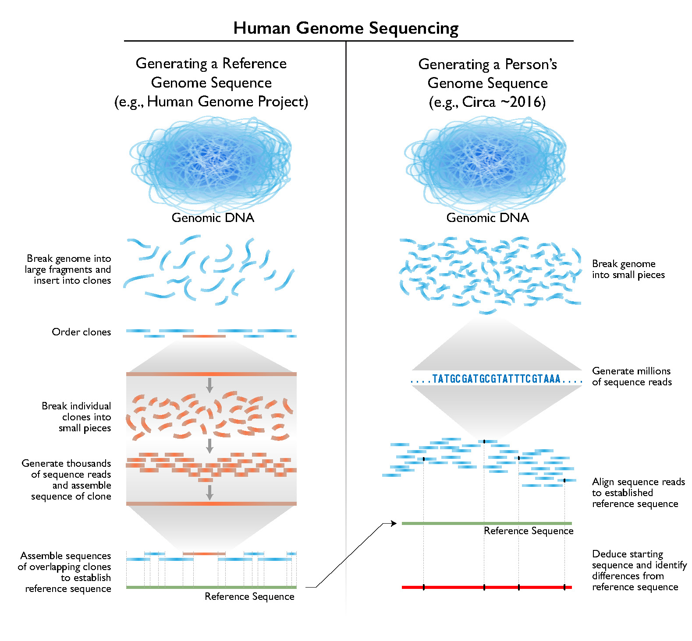
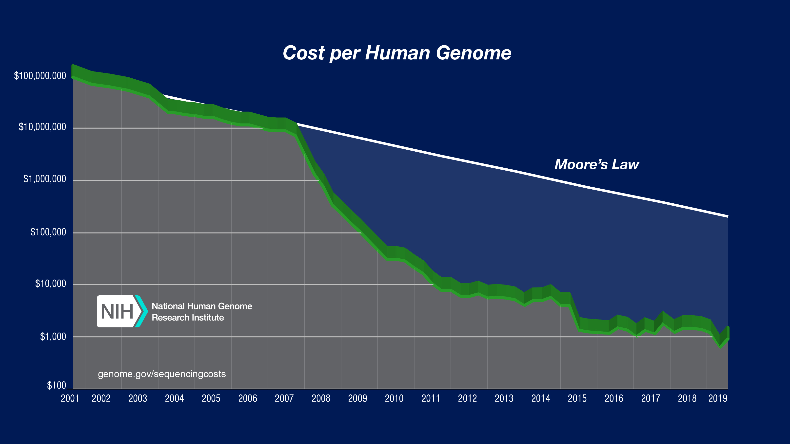
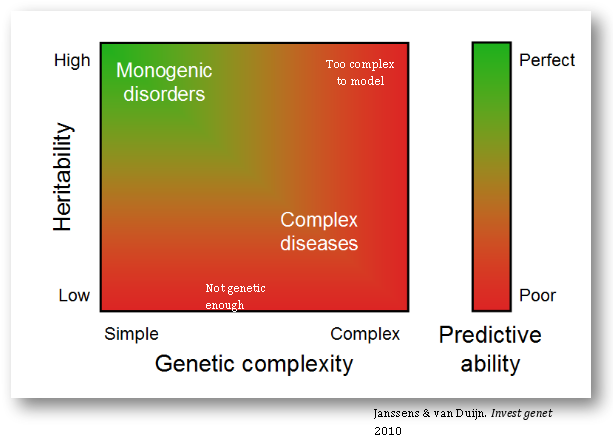
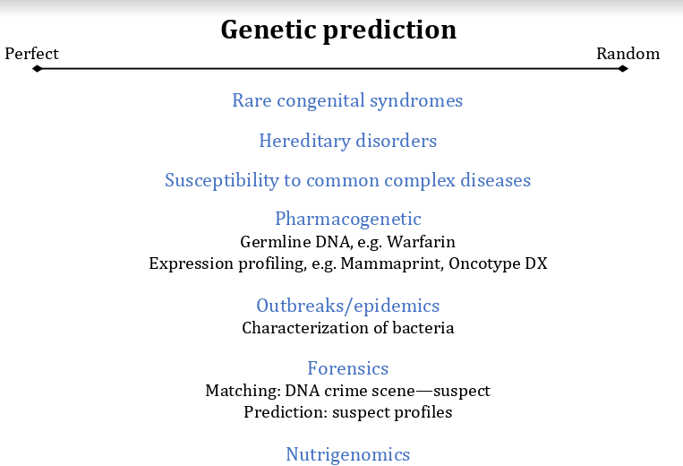
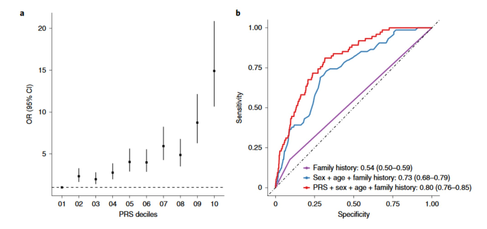

# Genetika

## Ląstelės ciklas

## Mitozė

## Mejozė

## Genai

## Genų sąveikos

### Epistazė

### Pleotropija

### Superdominavimas

### Kodominavimas

### Genetikos testai

2000 m. buvo sėkmingai sekvenuotas žmogaus genomas. Tai yra didžiulis pasiekimas, nes tuo metu sekvenavimo technologijos buvo brangios. Bet dar svarbiau - mes nenusekvenavome vieno konkretaus žmogaus genomo. Nusekvenavome **H. sapiens** genomą. 

```{r}



```

Nuo tada turime aukštos kokybės atskaitos tašką. Anksčiau sekvenavimas pareikalaudavo padalinti DNR į fragmentus (su restrikcijos endonukleazėmis), juos klonuoti (su PGR arba per vektorius), nuskaityti ir tuomet pagal persiklojančias DNR sritis atsekti, kurie fragmentai buvo vieni šalia kito (vadinamasis shotgun[^genetika1] sekvenavimas).

Dabar shotgun sekvenavimas yra retas dalykas - iš tikrųjų net nereikia DNR klonuoti! Nusekvenavę DNR fragmentą, dažniausiai mes galime pasakyti, kurioje genomo vietoje jis buvo pagal turimą pilną genomą. Kol anksčiau mes neturėjome visos knygos ir turėjo surinkti puslapius iš eilės pagal tai, kur baigiasi vienas, o prasideda kitas sakinys, dabar mes knygą turime. Ir tiksliai galime pasakyti, kuriam puslapiui ji priklauso.

Tai lėmė, jog sekvenavimo kaina labai sumažėjo, o fragmentų sugretinimas tapo greitesnis.

```{r}



```

Nepaisant to, jog sekvenavimas nelygus sekvenavimui, po kelių metų atsirado aibė įmonių, kurios pradėjo tiekti sekvenavimą vartotojams - geriausias pavyzdys yra 23andMe arba Myriad Genetics. Komercinis sekvenavimas dabar labiau yra pramoga negu kažkas informatyvaus, nes a) jis nėra tikslus, b) rizikos/tikimybės modeliai keičiasi ir nėra standartizuoti ir b) kas iš to, jog sužinosi kažką apie savo apytikslę geografinę kilmę?

O kaip sekvenavimas tyrimuose ir klinikoje? Tyrimai yra atliekami ir, pavyzdžiui, Jungtinė karalystė su savo genetiniu banku sugeba padaryti populiacinius tyrimus, kurie įprastai būtų neįmanomi. Kuo toliau, tuo geriau galime įvardinti, kokie genai padidina riziką susirgti tam tikra liga. Problema, jog kol kas vis dar nežinome daug apie priežastinius ryšius - negalime atsakyti, *kodėl* genas didina ligos riziką. Antra, nemažai dažniausių ligų yra iš dalies paveldimus, bet sunkiai nuspėjamos:

```{r}



```

Tokios ligos kaip cistinė fibrozė turi aiškią priežastį, todėl jų atsiradimą yra nesunku prognozuoti. Kuo daugiau genų ir sąveikų, tuo sunkiau yra prognozuoti ligos atsiradimą. Tai savo ruožtu reiškia, jog yra sunku sukurti gerą metodą, kuris patikimai nustatytų, ar žmogus ateityje susirgs tiriama liga. Pavyzdžiui, cistinės fibrozės, Hantingtono ligos ir fenilketonurija - *monogeninės ligos* -  turi aiškų geną, todėl galime iš anksto ištirti jį ir išvengti ligos atsiradimo arba bent jau sumažinti ligos vystymąsi. Su ligomis kaip širdies nepakankamumas arba antro tipo diabetas - *poligeninėmis ligomis* - kol kas geriausiu atveju galime nustatyti didesnę riziką, bet ligos atsiradimas priklausys daugiausia nuo aplinkos - ar žmogus sveikai maitinsis, ar jis sportuos ir pan.

Genomo sekvenavimas turi svarbią vietą medicinoje, tačiau tai jokiu būdu nėra panacėja. Jeigu pažiūrėtume į šią diagramą, į kurią pusę reikėtų nustumti kiekvieną atvejį?

```{r}




```

Atsakymą ir dar daugiau galite paskaityti čia:

1. https://drive.google.com/file/d/1kzV_5K1o0E3JtOqDmPxF51pcA4ckbgxU/view
2. http://www.cecilejanssens.org/wp-content/uploads/2018/01/PredictionManual2.0.pdf
3. https://www.ncbi.nlm.nih.gov/books/NBK26837/

## Straipsnio atvejis - AUC ir poligeninė rizika

Paprastai tyrimai, bandantys išsiaiškinti ligos priežastį, vyksta taip: surenkame pacientai, kurie turi ligos simptomus, surenkami savanoriai, kurie neturi simptomų, ir jų genomai yra sekvenuojami. Tuomet pagal SNP (single nucleotide polymorphism, vienos raidės skirtumų) yra konstruojamas rizikos modelis - jeigu vietoje timino turiu adeniną, ar aš susirgsiu glaukoma?

Panašų klausimą uždavė autoriai su šiuo [straipsniu](https://www.nature.com/articles/s41588-019-0556-y). Jeigu pažiūrėtume į jų pagrindinį grafiką, matome, jog AUC padidėjo nuo 0,73 iki 0,8 - idealus testo AUC yra 1, todėl tai atrodo kaip neblogas pasiekimas!

```{r}



```

Grafikas dešinėjė nėra sąžiningas - specifiškumo ašis yra apsukta. Retoms ligoms įprastai norime tyrimo, kuris būti specifiškas, bet nebūtinai jautrus, todėl šiame grafike turime kreipti dėmesį į apatinį kairį kampą. Ką mes matome? Skirtumas tarp modelio, kur vertinama ligos istorija, šeimos istorija, lytis ir amžius, ir modelio su poligeninės rizikos įverčiu yra mažas. Tai yra svarbu, nes AUC apibūdina bendrą testo (šiuo atveju, anamnezės surinkimo ir genetinio testo) veikimą, o nebūtinai tokį, koks yra svarbus kliniškai. Daugiau apie AUC kreivės interpretavimą galima rasti čia: https://twitter.com/cecilejanssens/status/1104134423673479169


[^genetika1]: nežinantiems, shotgun yra lygiavamzdis šautuvas, kuris gali iššauti daug smulkių šaratų vietoje vienos kulkos. Sekvenavimo metodas panašus - genomas yra iššaunamas į mažas daleles.


