# Augalai

## Įžanga

Augalai buvo mano nemėgstamiausia tema ruošiantis olimpiadoms, bet dabar manau visiškai priešingai. Augalai yra itin svarbūs mums - dėl bulvių maro Airijoje mirė penktadalis gyventojų, EUropoje įvyko ekonominė krizė dėl tulpių gumbų, o šafranas - žiedo piestelės - yra brangiausias prieskonis pasaulyje. Jeigu ne grūdai, ko gero nebūtume turėję feodalizmo ir nebūtume tyrinėję genetikos! Pažindamas augalus gali pažinti ne tik savo mitybą, bet ir žmogaus istoriją.

## Ląstelė

Skiriasi nuo eukariotinės gyvūno ląstelės šiais bruožais:

1. Chloroplastai - išsidėsto ląstelės kraštuose, vykdo fotosintezę
2. Centrinė vakuolė - viena, yra ląstelės centre, palaiko ląstelės formą, reguliuoja ląstelės vidinę terpę
3. Plazmodezmos - tai citoplazminis tiltelis tarp dviejų augalo ląstelių. Per jį gali judėti citoplazmos turinys, organelės bei virusai.
4. Ląstelės sienelė - ekstraląstelinė (*extra* - išorėje) struktūra, apsaugo nuo sužeidimų, palaiko formą, riboja vandens patekimą į ląstelę  
5. NĖRA centriolių - augalų ląstelės nevykdo citokinezės, iš Goldžio aparato pūslelių formuojasi membrana tarp dukterinių ląstelių

```{r, out.width = "500px", echo = FALSE}

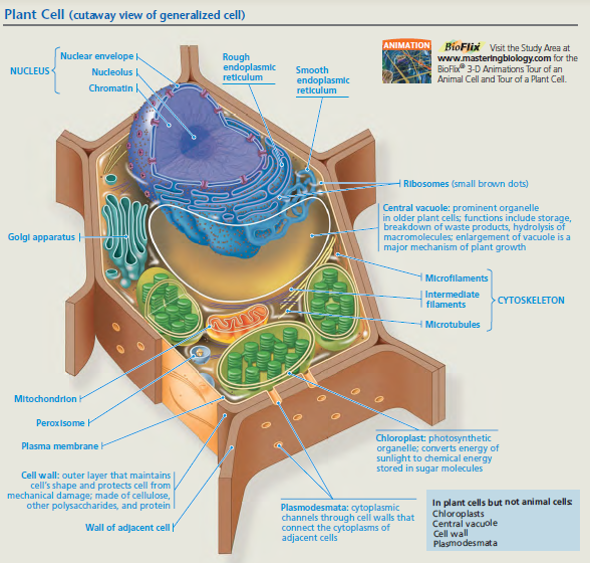

```

## Chloroplastai ir fotosintezė

Chloroplastai turi dvigubą membraną (pūslelė pūslelėje), viduje yra stroma, kurioje yra išsidėstę tilakoidai. Tilakoiduose yra fotosintezės aparatas, tilakoidai yra išsidėstę į granas. Šviesos ir tamsos reakcijos vyksta chloroplaste - šviesos reakcijos vyksta tilakoidų membranoje (protonų gradientas ATP sintezei kaupiamas tilakoidų viduje), tamsos reakcijos vyksta chloroplasto stromoje.

Fotosintezę vykdo ne tik augalai, bet ir protistai (_euglena_) bei prokariotai (_cianobakterijos_, vietoje chloroplastų turi tilakoidus citoplazmoje). Fotosintezė yra autotrofų mitybos būdas - jie pasigamina organines medžiagas iš CO2 ir kitų neorganinių medžiagų. Autotrofai yra biosferos gamintojai ir taip pat suteikia organines medžiagas likusiems organizmams - vartotojams (heterotrofams). 

Fotosintezė vyksta chloroplastuose ir yra sudaryta iš dviejų stadijų:

1. Šviesos fazės - šviesa panaudojama aktyvinti vandens elektronus ir jais redukuoti NADP iki NADPH ir protonų gradientu sintetinti ATP iš ADP ir fosfato grupės. 
2. Tamsos fazės - ATP ir NADPH yra naudojama kaip energijos šaltinis CO2 fiksacijai. Galutinis produktas - organiniai angliavandeniai, dažniausiai gliukozė ir fruktozė.

```{r, out.width = "500px", echo = FALSE}

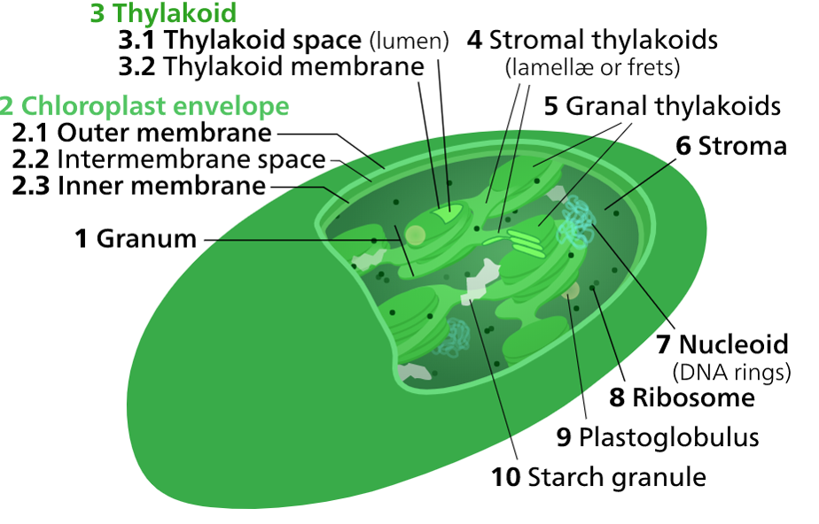

knitr::include_graphics("static/augalai/photosynthesis.png")

```

## Plazmodezmos

Augalinės ląstelės tarpusavyje turi plazminės membranos vamzdelius, kurie susisiekia per ląstelės sienelę. Stambios, pro jas gali judėti organelės, vanduo, makromolekulės. Greitesnė medžiagų pernaša, signalas tarp ląstelių perduodamas toliau. Bet gali judėti ir viruso DNR/RNR (tabako virusas), grybų hifai, bakterijos.

```{r, out.width = "500px", echo = FALSE}

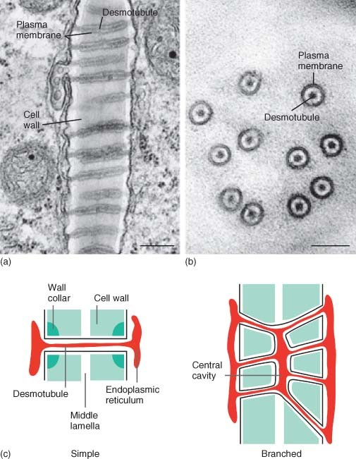

```


## Ląstelės sienelė

Augalo ląstelės sienelė sudaryta iš trijų pagrindinių dalių - celiuliozės, pektino ir hemiceliuliozės. Hemiceliuliozė tarpusavyje apjungia skirtingus celiuliozės pluoštus, o pektinas suteikia audiniui standumo ir apjungia ląsteles tarpusavyje. 

Augalo ląstelė visada turi pirminę sienelę, bet taip pat gali turėti ir antrinę sienelę, kuri yra įprastai storesnė, turi lignino bei suberino ir suteikia audiniui tvirtumo.

Pagal sienelės išsivystymą galima išskirti tris ląstelės sienelės tipus:

1. Parenchimą – minkštieji audiniai
2. Kolenchimą – augančios dalys
3. Sklerenchimą – nedalyvauja fotosintezėje, atraminė funkcija


## Plastidės

```{r, out.width = "500px", echo = FALSE}

knitr::include_graphics("static/augalai/plastids")

```

Chloroplastas yra plastidė, tačiau plastidės gali specializuotis atlikti kitas funkcijas (dažniausiai, kaupti specifines medžiagas).

Proplastidė - nediferencijuota plastidė
Chromoplastas - kaupia pigmentus
Amiloplastas - kaupia angliavandenius
Elajoplastas - kaupia riebalines medžiagas
Proteinoplastas - kaupia baltymus

## Centrinė vakuolė

1. Kaupia medžiagas
2. Kaupia druskų perteklių, nuodingas medžiagas, apykaitos produktai
3. Lizosominė funkcija
4. Elektrocheminis gradientas
5. Turgoras
6. Ląstelių augimas

## Augalo dalių adaptacijos

### Stiebų adaptacijos

1. Rizomai – horizontalus stiebas po žeme (vilkdalgis)
2. Svogūnai – stiebo sustorėjimas po žeme su maisto medžiagas kaupiančiais lapais (svogūnai, tulpės)
3. Ūsai – stiebo išaugos, kurios leidžia nelytiškai daugintis (braškės)
4. Stiebagumbiai – požeminis stiebas, turintis pumpurus (bulvė) 

### Šaknų adaptacijos

1. Šakniavaisiai – atlieka kaupiamąją funkciją (burokėlis)
2. Pneumatoforai – išdygsta į orą, kai pelkėse nėra deguonies (mangrovė)
3. Atraminės šaknys – kai dirva minkšta, padeda augalui išsilaikyti (banjanas)
4. Orinės šaknys – dygsta ore, įsiskerbusios įsišaknyja (monstera)

### Lapų adaptacijos

1. Ūsai (ang. tendrils) – padeda prisitvirtinti prie paviršių (vijokliniai augalai, pupa)
2. Spygliai – taip, kaktuso „lapas“ yra stiebas
3. Kaupia maisto medžiagas – visi sukulentai
4. Dauginimosi lapai – išdygę nukrenta ir sudygsta ant žemės
5. Pažiedlapiai – vainiklapių pamaina (puansentija)


## Iliustracijos

```{r, out.width = "500px", echo = FALSE}

knitr::include_graphics("static/augalai/augalo_dalys.png")
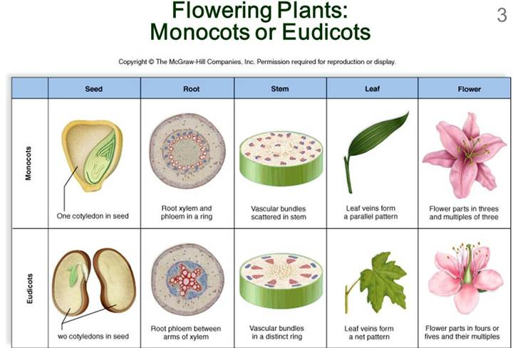
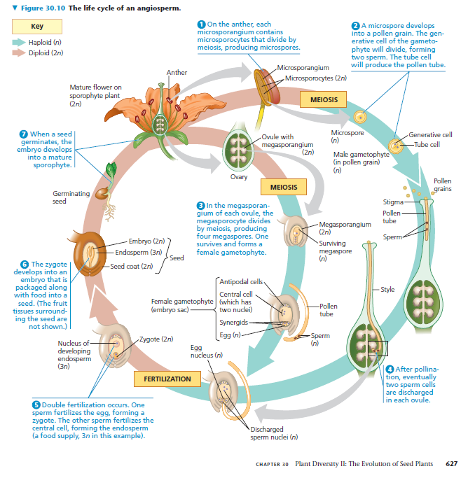
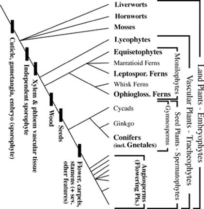
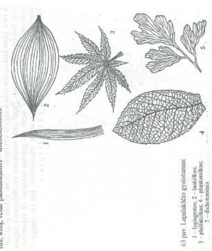
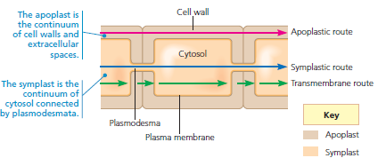
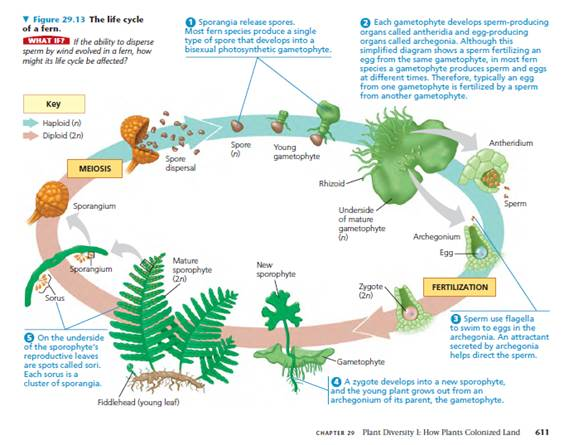
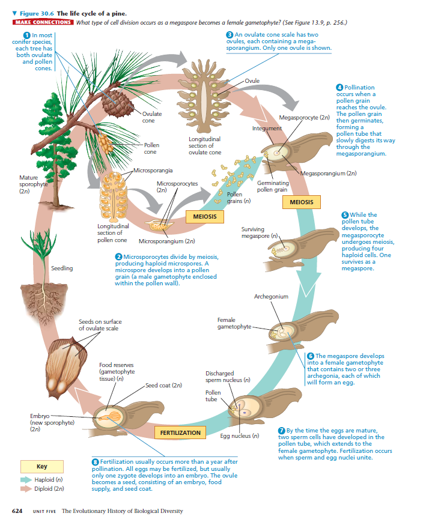
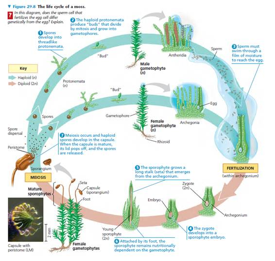
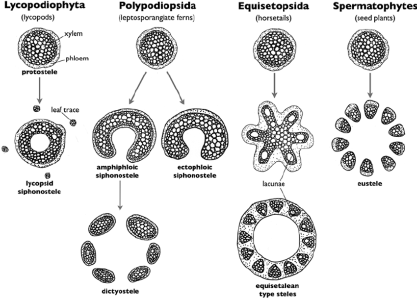
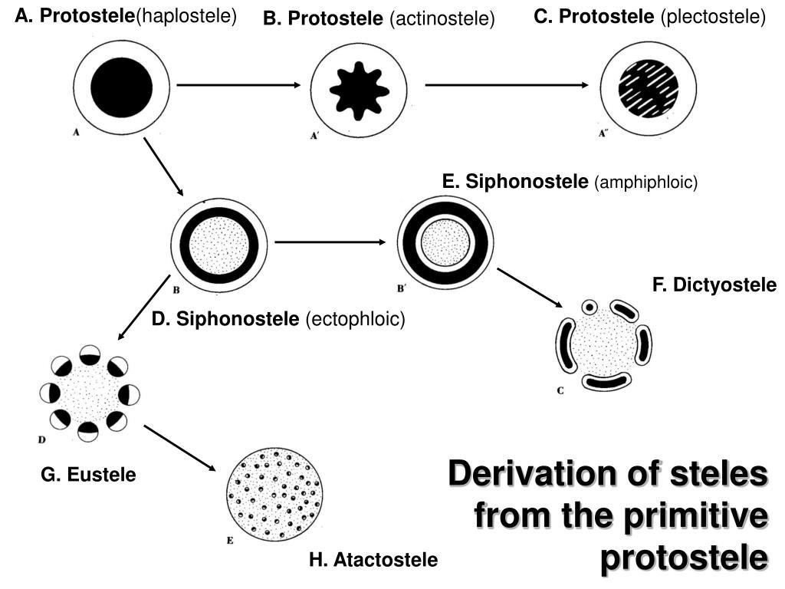
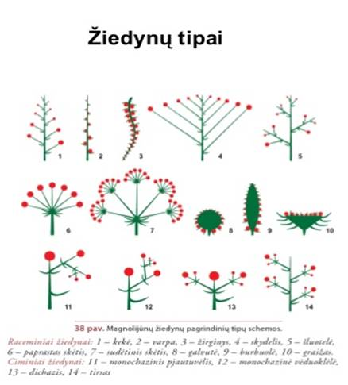

```
