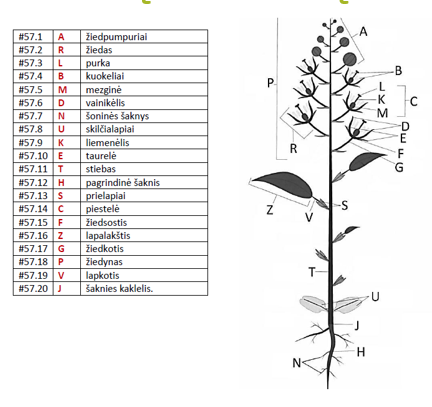

# Augalų įžanga

## Ląstelė

Skiriasi nuo eukariotinės gyvūno ląstelės šiais bruožais:

1. Chloroplastai
2. Centrinė vakuolė
3. Plazmodezmos[^1] jungia ląsteles
4. Ląstelės sienelė
5. NĖRA centriolių

## Chloroplasto struktūra ir funkcija

1. Dviguba membrana (pūslelė pūslelėje), viduje yra stroma, kurioje yra išsidėstę tilakoidai. Tilakoiduose yra fotosintezės aparatas, tilakoidai yra išsidėstę į granas.
2. Chloroplasto funkcija versti saulės energiją į angliavandenius. Tai vyksta dviem etapais: šviesos ir tamsos reakcijomis. Šviesos reakcijos 

## Plazmodezmos

```{r, out.width = "500px"}



```


## Ląstelės sienelė

## Plastidės

Centrinė vakuolė


Terminai

[^1]: Plazmodezmos - tai citoplazminis tiltelis tarp dviejų augalo ląstelių. Per jį gali judėti citoplazmos turinys, organelės bei virusai.