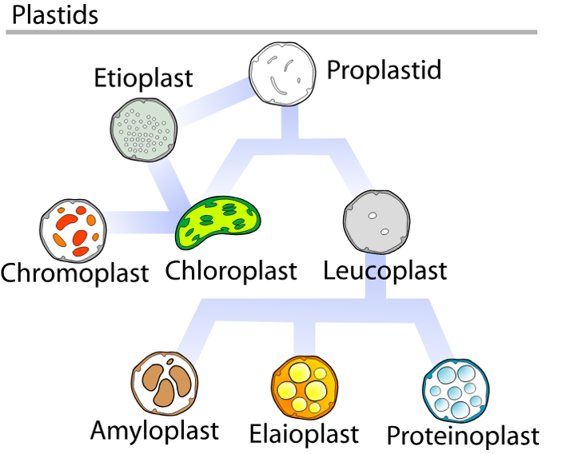

# Augalai

## Įžanga

Augalai buvo mano nemėgstamiausia tema ruošiantis olimpiadoms, bet dabar manau visiškai priešingai. Augalai yra itin svarbūs mums - dėl bulvių maro Airijoje mirė penktadalis gyventojų, EUropoje įvyko ekonominė krizė dėl tulpių gumbų, o šafranas - žiedo piestelės - yra brangiausias prieskonis pasaulyje. Jeigu ne grūdai, ko gero nebūtume turėję feodalizmo ir nebūtume tyrinėję genetikos! Pažindamas augalus gali pažinti ne tik savo mitybą, bet ir žmogaus istoriją.

## Ląstelė

Skiriasi nuo eukariotinės gyvūno ląstelės šiais bruožais:

1. Chloroplastai - išsidėsto ląstelės kraštuose, vykdo fotosintezę
2. Centrinė vakuolė - viena, yra ląstelės centre, palaiko ląstelės formą, reguliuoja ląstelės vidinę terpę
3. Plazmodezmos - tai citoplazminis tiltelis tarp dviejų augalo ląstelių. Per jį gali judėti citoplazmos turinys, organelės bei virusai.
4. Ląstelės sienelė - ekstraląstelinė (*extra* - išorėje) struktūra, apsaugo nuo sužeidimų, palaiko formą, riboja vandens patekimą į ląstelę  
5. NĖRA centriolių - augalų ląstelės nevykdo citokinezės, iš Goldžio aparato pūslelių formuojasi membrana tarp dukterinių ląstelių

```{r, out.width = "500px", echo = FALSE}

knitr::include_graphics("static/augalai/plant_cell.png")

```

## Chloroplastai ir fotosintezė

Chloroplastai turi dvigubą membraną (pūslelė pūslelėje), viduje yra stroma, kurioje yra išsidėstę tilakoidai. Tilakoiduose yra fotosintezės aparatas, tilakoidai yra išsidėstę į granas. Šviesos ir tamsos reakcijos vyksta chloroplaste - šviesos reakcijos vyksta tilakoidų membranoje (protonų gradientas ATP sintezei kaupiamas tilakoidų viduje), tamsos reakcijos vyksta chloroplasto stromoje.

Fotosintezę vykdo ne tik augalai, bet ir protistai (_euglena_) bei prokariotai (_cianobakterijos_, vietoje chloroplastų turi tilakoidus citoplazmoje). Fotosintezė yra autotrofų mitybos būdas - jie pasigamina organines medžiagas iš CO2 ir kitų neorganinių medžiagų. Autotrofai yra biosferos gamintojai ir taip pat suteikia organines medžiagas likusiems organizmams - vartotojams (heterotrofams). 

Fotosintezė vyksta chloroplastuose ir yra sudaryta iš dviejų stadijų:

1. Šviesos fazės - šviesa panaudojama aktyvinti vandens elektronus ir jais redukuoti NADP iki NADPH ir protonų gradientu sintetinti ATP iš ADP ir fosfato grupės. 
2. Tamsos fazės - ATP ir NADPH yra naudojama kaip energijos šaltinis CO2 fiksacijai. Galutinis produktas - organiniai angliavandeniai, dažniausiai gliukozė ir fruktozė.

```{r, out.width = "500px", echo = FALSE}

knitr::include_graphics("static/augalai/chloroplast.png")

knitr::include_graphics("static/augalai/photosynthesis.png")

```

## Plazmodezmos

Augalinės ląstelės tarpusavyje turi plazminės membranos vamzdelius, kurie susisiekia per ląstelės sienelę. Stambios, pro jas gali judėti organelės, vanduo, makromolekulės. Greitesnė medžiagų pernaša, signalas tarp ląstelių perduodamas toliau. Bet gali judėti ir viruso DNR/RNR (tabako virusas), grybų hifai, bakterijos.

```{r, out.width = "500px", echo = FALSE}

knitr::include_graphics("static/augalai/plasmodesmata.jpg")

```


## Ląstelės sienelė

Augalo ląstelės sienelė sudaryta iš trijų pagrindinių dalių - celiuliozės, pektino ir hemiceliuliozės. Hemiceliuliozė tarpusavyje apjungia skirtingus celiuliozės pluoštus, o pektinas suteikia audiniui standumo ir apjungia ląsteles tarpusavyje. 

Augalo ląstelė visada turi pirminę sienelę, bet taip pat gali turėti ir antrinę sienelę, kuri yra įprastai storesnė, turi lignino bei suberino ir suteikia audiniui tvirtumo.

Pagal sienelės išsivystymą galima išskirti tris ląstelės sienelės tipus:

1. Parenchimą – minkštieji audiniai
2. Kolenchimą – augančios dalys
3. Sklerenchimą – nedalyvauja fotosintezėje, atraminė funkcija


## Plastidės

```{r, out.width = "500px", echo = FALSE}



```

Chloroplastas yra plastidė, tačiau plastidės gali specializuotis atlikti kitas funkcijas (dažniausiai, kaupti specifines medžiagas).

Proplastidė - nediferencijuota plastidė
Chromoplastas - kaupia pigmentus
Amiloplastas - kaupia angliavandenius
Elajoplastas - kaupia riebalines medžiagas
Proteinoplastas - kaupia baltymus

## Centrinė vakuolė

1. Kaupia medžiagas
2. Kaupia druskų perteklių, nuodingas medžiagas, apykaitos produktai
3. Lizosominė funkcija
4. Elektrocheminis gradientas
5. Turgoras
6. Ląstelių augimas

## Augalo dalių adaptacijos

### Stiebų adaptacijos

1. Rizomai – horizontalus stiebas po žeme (vilkdalgis)
2. Svogūnai – stiebo sustorėjimas po žeme su maisto medžiagas kaupiančiais lapais (svogūnai, tulpės)
3. Ūsai – stiebo išaugos, kurios leidžia nelytiškai daugintis (braškės)
4. Stiebagumbiai – požeminis stiebas, turintis pumpurus (bulvė) 

### Šaknų adaptacijos

1. Šakniavaisiai – atlieka kaupiamąją funkciją (burokėlis)
2. Pneumatoforai – išdygsta į orą, kai pelkėse nėra deguonies (mangrovė)
3. Atraminės šaknys – kai dirva minkšta, padeda augalui išsilaikyti (banjanas)
4. Orinės šaknys – dygsta ore, įsiskerbusios įsišaknyja (monstera)

### Lapų adaptacijos

1. Ūsai (ang. tendrils) – padeda prisitvirtinti prie paviršių (vijokliniai augalai, pupa)
2. Spygliai – taip, kaktuso „lapas“ yra stiebas
3. Kaupia maisto medžiagas – visi sukulentai
4. Dauginimosi lapai – išdygę nukrenta ir sudygsta ant žemės
5. Pažiedlapiai – vainiklapių pamaina (puansentija)

## C3, C4 ir CAM augalai

### Kodėl tai svarbu?

Ribos tarp C3 ir C4 augalų nėra tokios griežtos kaip atrodo: kai kurie augalai sugeba pakeisti savo lapų struktūrą iš C3 į C4 ir atvirkščiai. Tai duoda vilties, jog pavyktų rasti genus, kuriuos modifikavus pavyktų kai kuriuos augalus paversti iš C3 į C4. Kaip aptarėme aukščiau, C4 augalai yra atsparesni aukštesnėms temperatūroms. Dar svarbiau, jie reikalauja mažiau vandens. Dėl to, jeigu pavyktų išvesti dabartinių kultūrų C4 ekvivalentus, žemdirbiai galėtų sutaupyti žymiai daugiau vandens ir auginti kultūras ten, kur joms įprastai būdavo per karšta. Genų atradimas smarkiai pagerintų mūsų gyvenimo kokybę ir žemdirbystės galimybes.

Paskutinį dešimtmetį atsirado ne vienas tyrimas apie anglies dioksido koncentracijos kambaryje įtaką žmogaus savijautai. Berkely buvo [pirmieji](https://www.ncbi.nlm.nih.gov/pmc/articles/PMC3548274/), kurie nustatė, jog didesnės CO2 koncentracijos blogina protines funkcijas. Rezultatai atitinka [vengrų](https://www.researchgate.net/publication/279567093_Influence_of_carbon-dioxide_pollutant_on_human_well-being_and_work_intensity) ir [Harvardo](https://dash.harvard.edu/bitstream/handle/1/27662232/4892924.pdf?sequence=1) tyrimus. NASA taip pat susidomėjo šia sritimi, nes kosminiuose laivuose nėra daug langų, o reikia daug protinio darbo. Jų [preliminarūs rezultatai](https://ntrs.nasa.gov/archive/nasa/casi.ntrs.nasa.gov/20160013696.pdf) rodo, jog ko gero didesni CO2 kiekiai aplinkoje sunkina žmogaus gebėjimą dirbti protinį darbą.

Aišku, vienas iš sprendimų yra tiesiog atverti langą ir palikti atviras duris prieš einant miegoti. Ko gero, to turėtų užtekti, jog CO2 kiekiai išliktų žemi. Kitas būdas yra auginti augalus, kurie naudoja CAM metabolizmą. Kadangi CAM augalai vykdo fotosintezę dieną, o naktį vykdo anglies fiksaciją, mums miegant CAM augalai išskiria O2 ir surenka CO2 iš aplinkos. CAM augalai nebūtinai auga tropinėse platumose - tai yra sukulentai. Storlapiai, orchidėjos, kaktusai, uošvės liežuvis. Nežinau, kiek augalų reikėtų, jog jie kartu turėtų poveikį kambario CO2 lygiui, bet kita vertus, juos lengva prižiūrėti ir jie gana #estetiški.


## Iliustracijos

```{r, out.width = "500px", echo = FALSE}

knitr::include_graphics("static/augalai/augalo_dalys.png")
knitr::include_graphics("static/augalai/dvi_vienskilciai.jpg")
knitr::include_graphics("static/augalai/gaubtasekliai.png")
knitr::include_graphics("static/augalai/klasifikacija.jpg")
knitr::include_graphics("static/augalai/lapo_gyslotumas.png")
knitr::include_graphics("static/augalai/medz_judejimas.png")
knitr::include_graphics("static/augalai/papartunai.jpg")
knitr::include_graphics("static/augalai/plikasekliai.png")
knitr::include_graphics("static/augalai/samanunai.jpg")
knitr::include_graphics("static/augalai/steles_1.png")
knitr::include_graphics("static/augalai/steles_2.jpg")
knitr::include_graphics("static/augalai/ziedynu_tipai.jpg")

```
