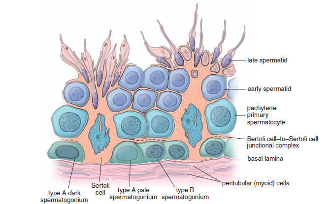

# Reprodukcinė sistema

## Skirting7 gyv8n7 

## Moters reprodukcinė sistema

## Vyro reprodukcinė sistema

Vyro reprodukcinę sistemą sudaro:

1. Sėklidės
2. Genital excurrent ducts
3. Accesory sex glands
4. External genitalia - penis and scrotum

Pagrindinės funkcijos:

1. Spermatogenezė - spermos (vyriškų gametų) gamyba, dalyvauja *Sertoli* ląstelės
2. Steroidogenezė - androgenų (lytinių hormonų) gamyba, dalyvauja *Leidigo* ląstelės

### Spermatogenezė

Spermatogenezė turi tris fazes:

1. Spermatogonijų fazė - *spermatogonijos* dalijasi *mitozės* būdu, jog palaikytų spermatogonijų populiaciją, kurių didžioji dalis bręsta į *pirminius spermatocitus*.
2. Spermatocitų fazė - pirminiai spermatocitai vykdo *mejozę* ir tampa *spermatidėmis*. 
3. Spermatidžių fazė - spermatidės tampa *spermatozoidais*.

Šios fazės vyksta sėkliniuose kanalėliuose sėklidėse:

```{r, echo = FALSE}



```

Schemos viršuje yra kanalėlio spindis, o apačioje - lygieji raumenys ir kapiliarai. Prie pamatinės membranos (basal lamina) esti spermatogonijos, kurios dalijasi mitotiškai - įprastai viena ląstelė lieka toliau mitotiškai dalytis, o kita keliauja per *Sertoli ląstelių* barjerą į kanalėlio spindžio pusę ir bręsta iki spermatidės vykdydama mejozę.

*Sertoli ląstelės* atlieka kelias funkcija - viena, manoma, jog jos suteikia maisto medžiagas ir šalina metabolitus iš bręstančių spermatogonijų. Antra, jos tikrai fagocituose nereikalingą citoplazmą ir plazminę membraną, kurios spermatogonija netenka bręsdama į spermatidę. Trečia, Sertoli ląstelės išskiria kanalėlių skystį ir pačios turi virpamųjų gaurelių, todėl jos skatina spermatidžių judėjimą iš kanalėlių tolyn iki prielipo (juolab kad spermatidės nėra judrios iš pat pradžių).

### Steroidogenezė

Steroidų sintezė sėklidėse atlieka Leidigo (intersticinės) ląstelės. Pagrindinis hormonas - *testosteronas*, kuris atlieka skirtingus vaidmenis žmogaus gyvenime:

1. Embriono vystymosi metu skatina sėklidžių nusileidimą
2. Lytinio brendimo (paauglystės) metu inicijuoja spermos gamybą, priedinių liaukų sekreciją ir antrinių lytinių bruožų vystymąsi.
3. Suaugusiame žmoguje testosteronas palaiko spermos gamybą ir antrinius lytinius bruožus.

Galiausiai, kadangi testosteronas yra steroidinis hormonas, Leidigo ląstelės turi daug riebalinių intarpų bei turi išreikštą lygųjį endoplazminį tinklą, kuriame vyksta testosterono sintezė.


