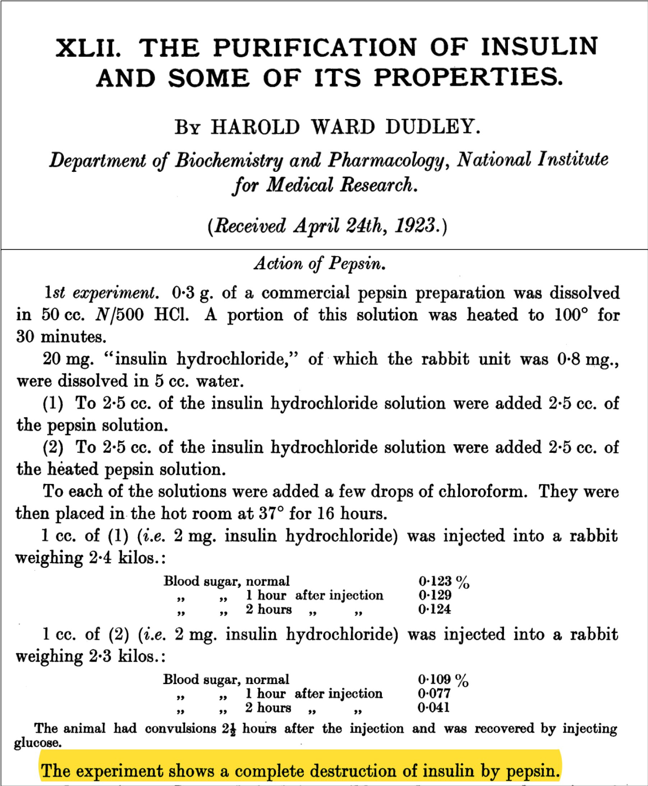
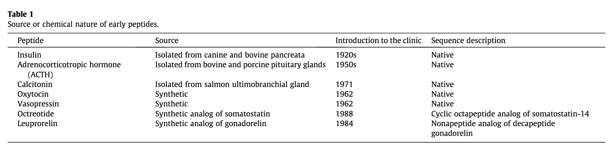
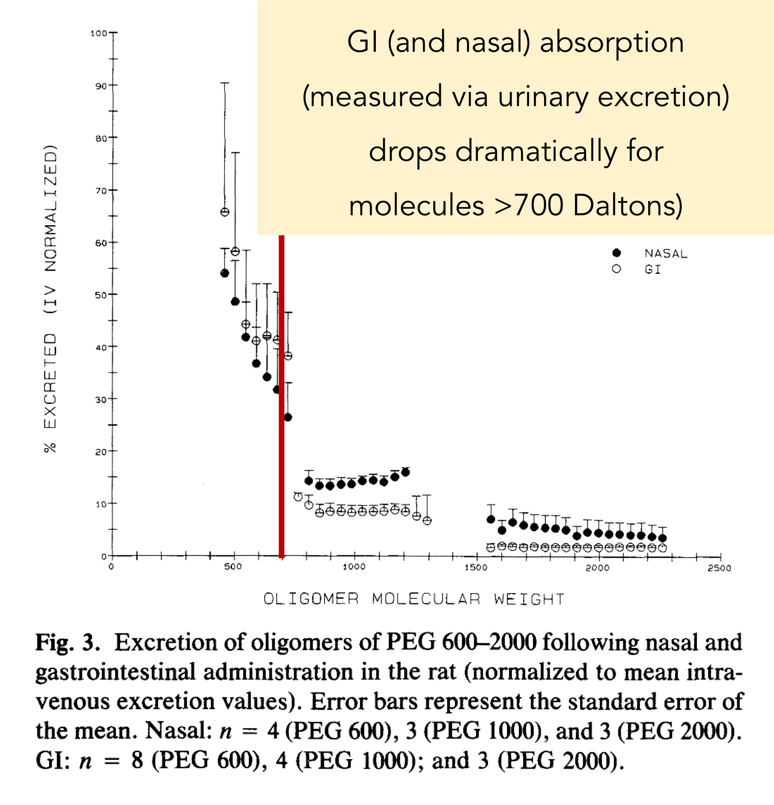
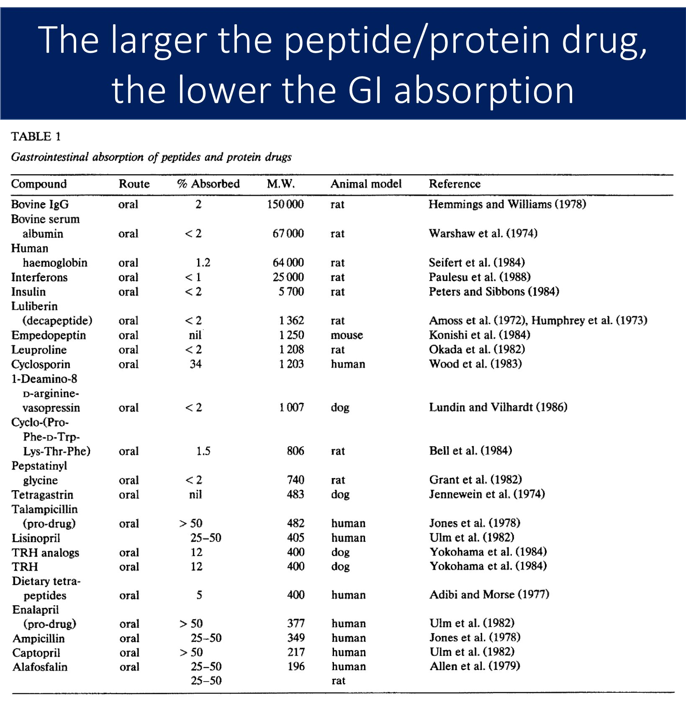
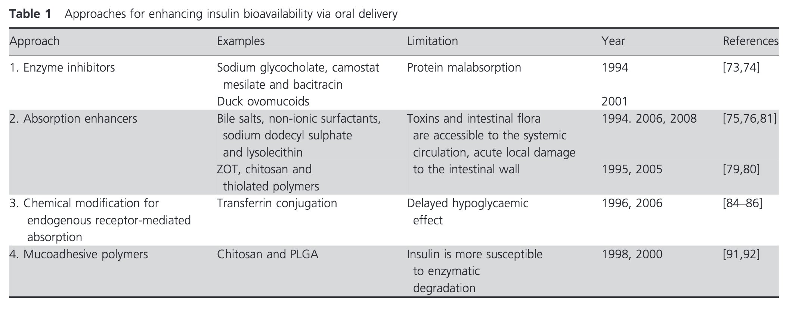

# Įvairybės

## Deguonis ir anglies dioksidas

Įrodykite arba paneikite teiginį: tai, ką įkvėpiame, pašaliname su šlapimu, o tai, ką suvalgome, iškvėpiame. 

Įkvėptas deguonis organizme yra naudojamas kaip elektronų akceptorius elektronų pernašos grandinėje. Priimdamas elektronus deguonis turi per daug elektronų ir turi prisijungti porą protonų, sudarydamas vandenį. Vandens šiek tiek iškvėpiame, tačiau kiekis yra sąlyginai mažas - didžioji dalis yra pašalinama su šlapimu. Tuo tarpu maistas, kurį suvalgome, daugiausia yra pasiunčiamas į Krebso ciklą, kur vieno ciklo metu yra pašalinamos 2 molekulės anglies dioksido. Nors anglies dioksidas gali sudaryti karbonato joną (HCO3), kuris patenka į nefroną, tačiau jis yra atgal rezorbuojamas. Anglies dioksidas pasišalina iš žmogus organizmą per plaučius. Dėl to, tai, ką suvalgome, pašaliname kvėpuodami, o tai, ką įkvėpiame, pašaliname su šlapimu.

## Vaistų skyrimas į veną

Viena iš priežasčių vaistai skiriami į veną yra gana akivaizdi - priešingai negu per burną, vaistas iš karto atsiduria kraujotakoje ir gali keliauti iki savo taikinio. Kita svarbi priežastis - žarnynas nebūtinai yra dėkinga vieta vaistams.

Pavyzdžiui, insulinas turi būti leidžiamas į poodį arba į kraujotaką, nes jis yra peptidas, didelis peptidas (5,8 kDa). Bet koks didelis peptidas galimai bus suvirškintas - trečiame dešimtmetyje H.W. Dudley parodė, jog pepsinas ir tripsinas *pilnai* suskaido insuliną.

```{r}



```

Tai nėra išskirtinė insulino savybė. Žemiau lentelėje yra peptidiniai vaistai - nei vienas nėra skiriamas per burną:

```{r}



```

Grįžtant prie insulino, jis kraujyje yra suskaidomas kraujo fermentų ([taip, tokie yra](https://www.ncbi.nlm.nih.gov/pubmed/4935637)) ir turi 10 minučių puslaikį. Tai sukelia problemų dėl vartojimo pro burną - vos insulinas šiaip ne taip patektų į kraujotaką, jis praktiškai iš karto būtų suskaidytas kraujyje. Ir kai vaistų veikimas yra priklausomas nuo pakankamos koncentracijos, tai sudaro dar vieną kliūtį vartojimui pro burną.

Antra problema - absorbcija. Žarnynas gali įsisavinti baltymus iki 700 daltonų. Bet kas didesnio patenka į kraujotaką sunkiai:

```{r}



```

Tas pats galioja ir kitiems baltymams - dėl to mes pro burną neskiriame albumino arba inerferono[^var1]:

```{r}



```

Galiausiai, insulinas hidrofiliškumas ne tik slopina patekima iš žarnyno į kraują, bet taip pat palengvina patekimą pro glomerulę į nefroną. Ar kas nors buvo padaryta atrasti sprendimą? Daug žmonių kasdien turi leistis insuliną, bet iki šiol bandyti sprendimai nedavė rezultatų:

```{r}



```

[^var1]: Antibiotikas ciklosporinas yra išimtis - jis yra ciklinis peptidas, kurio žarnyno fermentai nesuskaido.

https://pubmed.ncbi.nlm.nih.gov/32573431/

Neil deGrasse Tyson (teigia)[https://twitter.com/neiltyson/status/1275870809794375682], jog ateivis, kurio DNR nesusijusi su gyvybe žemėje atrodys labiau kitaip negu dvi skirtingiausias rūšys Žemėje. Į ką būtų panašiausias ateivis, atvykęs iš svetimos planetos? Ar jis būtų panašus į gyvūną, kuris egzistuoja Žemėje, ar jis būtų visiškai kitoks negu visi gyvi gyvūnai? Kodėl? https://en.m.wikipedia.org/wiki/Convergent_evolution
