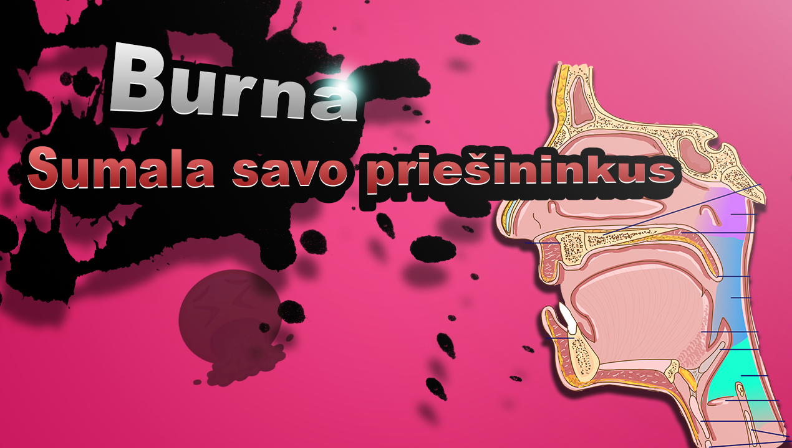
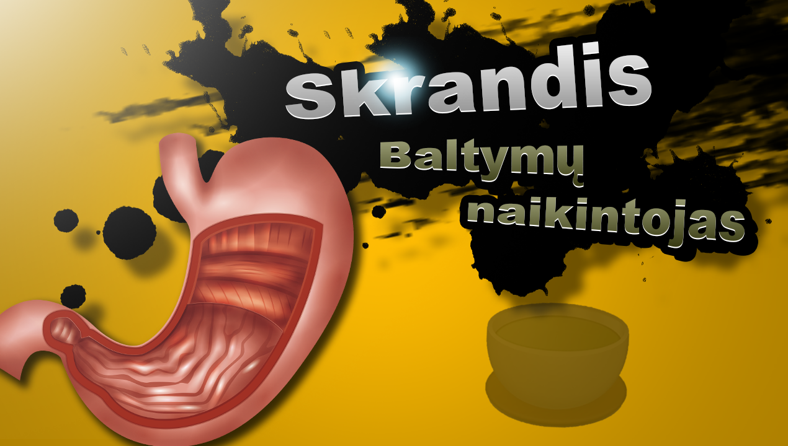
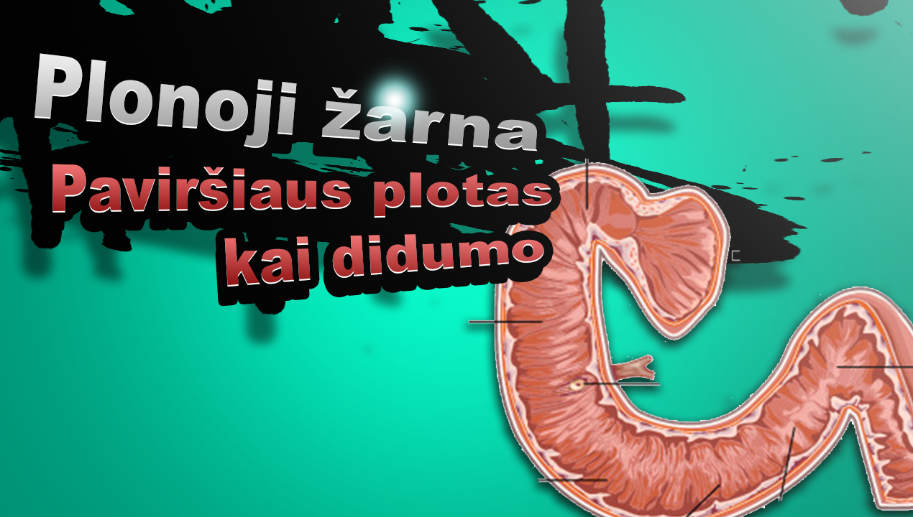
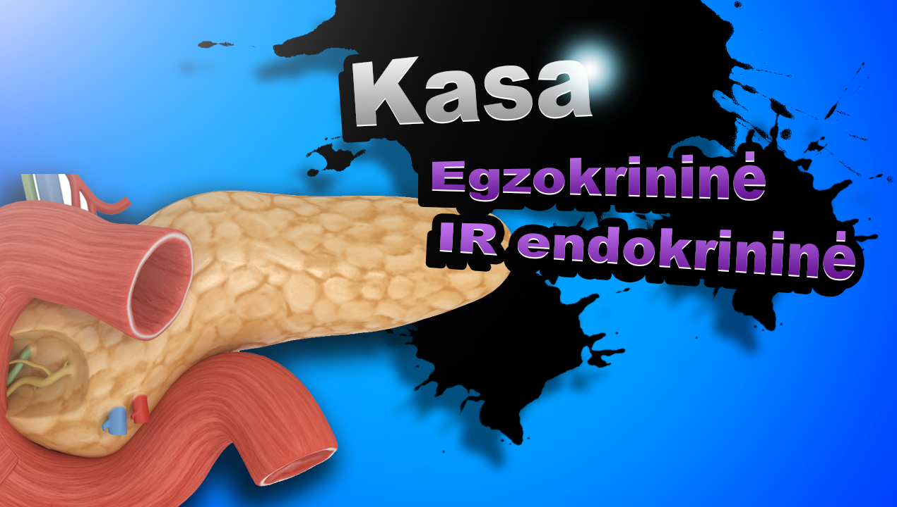
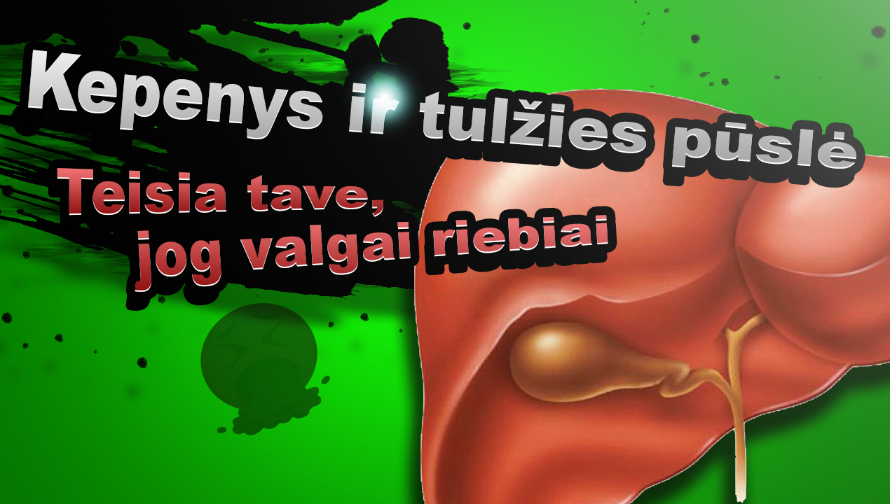
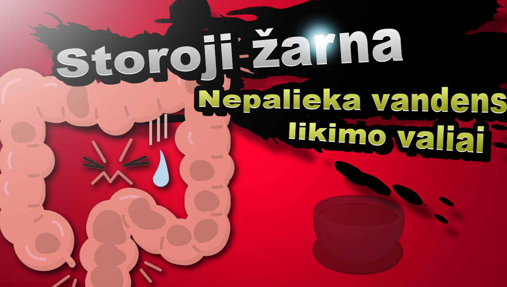

# Virškinimas

Žmogus yra heterotrofas ir išgyvenimui turi maitintis kitų organizmų medžiagomis, jog išgyventų. Tam yra virškinimo sistema, kurią sudaro *virškinimo traktas* ir *virškinimo liaukos*. Virškinimas yra nuostabus procesas, nes jis apjungia kelis procesus, kurie vyksta vienu metu: medžiagų judėjimą virškinimo traktu, medžiagų cheminį virškinimą su virškinimo liaukų išskirtais fermentais ir medžiagų įsisavinimo (absorbcijos) reguliaciją. Skyrius suskaidytas į virškinimo etapus nuo maisto patekimo pro burną iki pašalinimo per išeinamąją angą.


```{r setup, include=FALSE}
knitr::opts_chunk$set(echo = FALSE)
```

## Burna

```{r}



```

Burną sudaro daug skirtingų organų, nes burna prisideda ne tik prie maisto virškinimo, bet ir kalbos. 

Kramtymas yra svarbus keliais aspektais:
1. Maistas dažnai turi nesuvirškinamas dalis (celiuliozę), kuri saugo maistingas dalis (pavyzdžiui, vaisiai), kramtymas leidžia fermentams turėti kontaktą su maistingomis dalimis.
2. Padidina virškinamo maisto paviršiaus plotą
3. Sumala maistą į smulkią masę, todėl ji lengviau slenka virškinamuoju traktu bei nepažeidžia virškinamo trakto gleivinės.

Išskirtos seilės turi kelias funkcijas:
1. Valgymo metu: jos suvilgo maistą, seilėse esanti $\alpha$-amilazė skaido polisacharidus (krakmolą)
2. Bendrai seilės išsiskiria nuolatos ir tai irgi turi svarbos: seilės nuplauna kenksmingas bakterijas ir maisto daleles, kuriomis jos galėtų misti. Taip pat seilėse ir lizocimo bei antikūnų, kurie naikina arba inaktyvuoja bakterijas.

*Seilės yra šarmiškos, pH tarp 6 ir 7.*

## Stemplė

Stemplė yra aktyvus organas - lygieji raumenys stemplėje aktyviai stumia sukramtytą maistą žemyn į skrandį. Tarp stemplės ir skrandžio yra piliorinis sfinkteris, kuris saugo, jog skrandžio rūgštus turinys negrįžtų į stemplę. Dėl aktyvių stemplės judėsių ir sfinkterio maistas negali tiesiog grįžti į burną, pavyzdžiui, stovint aukštyn kojomis.

## Skrandis

```{r}



```

Skrandis nuostabus organas - jis turi tris lygiųjų raumenų sluoksnius, ir gleivinę, kuri išskiria du pagrindinius dalykus: HCl ir pepsiną. 

## Dvylikapirštė žarna


```{r}



```


## Kasa


```{r}



```

## Kepenys


```{r}



```

## Storoji žarna


```{r}



```


## Užduotys

1. Sugalvokite savo Smash Bros tematikos memą - koks galėtų būti kiekvieno organo prisistatymas į kovą?
2. Šiame skyriuje sužinojote apie organus ir jų normalią funkciją, įvardinkite vieną virškinimo sistemos sutrikimą ir paaiškinkite, kaip sutrinka organo funkcija ir išsivysto liga. Virškinimo sistemos sutrikimų ir ligų pavyzdžiai: ėduonis, achalazija, skrandžio opaligė, tūlžies pūslės akmenligė, pankreatitas, celiakija, opinis kolitas.